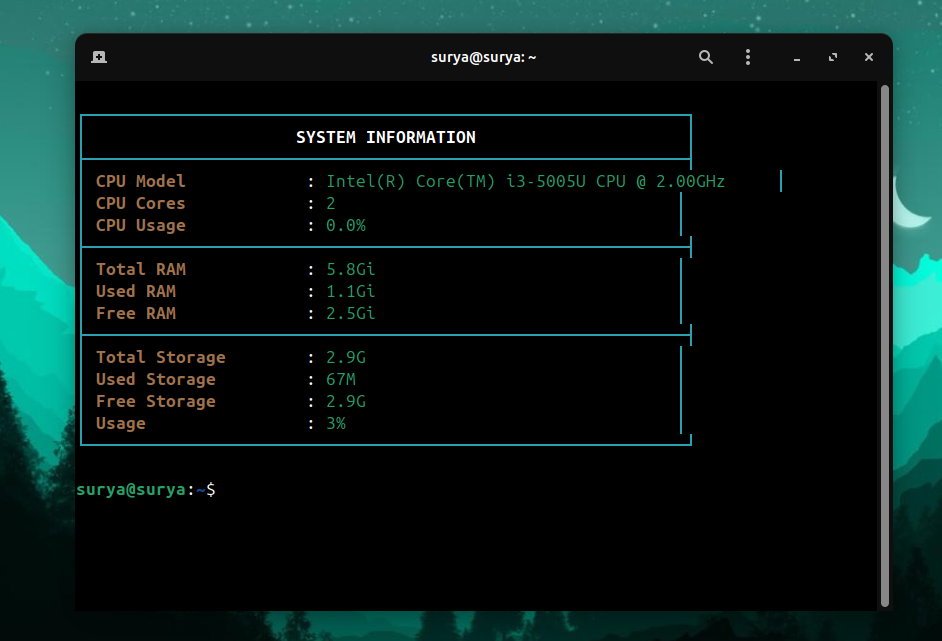
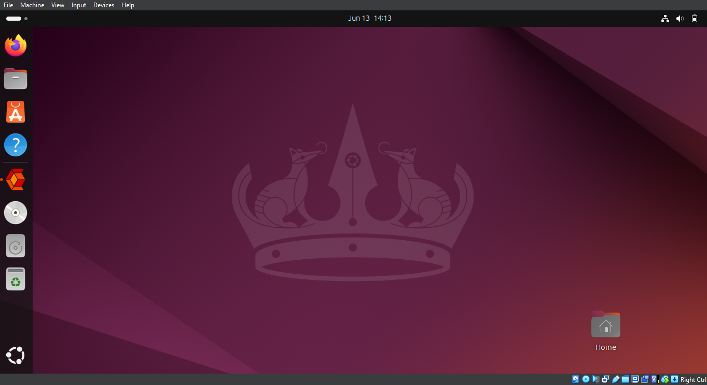
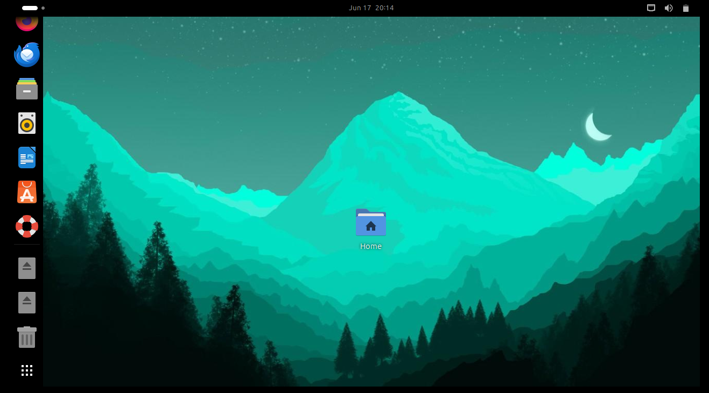
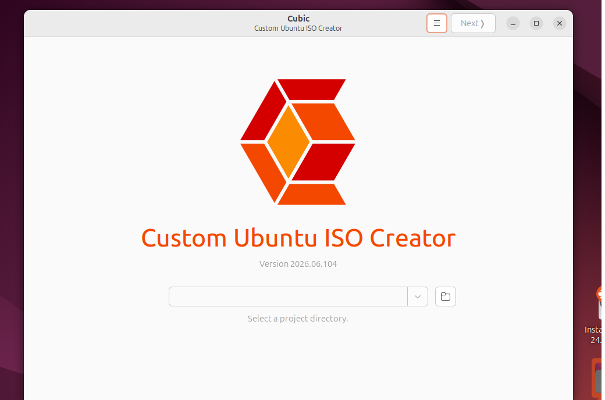
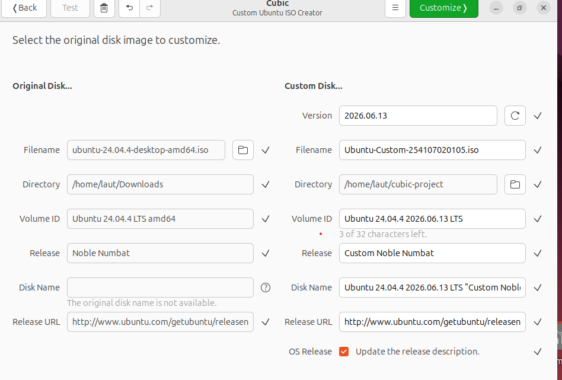
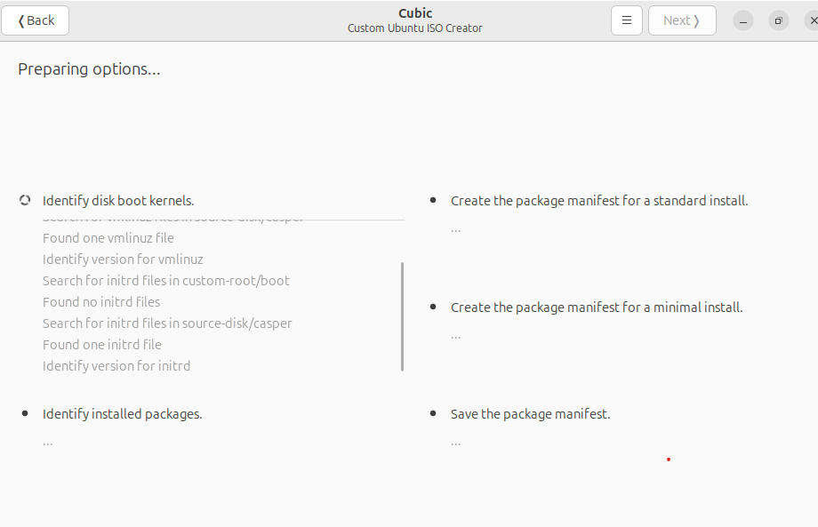
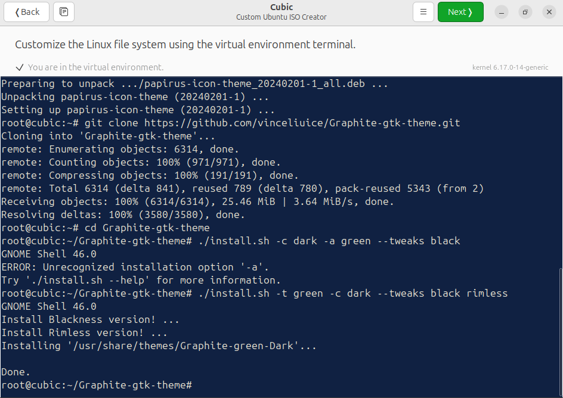
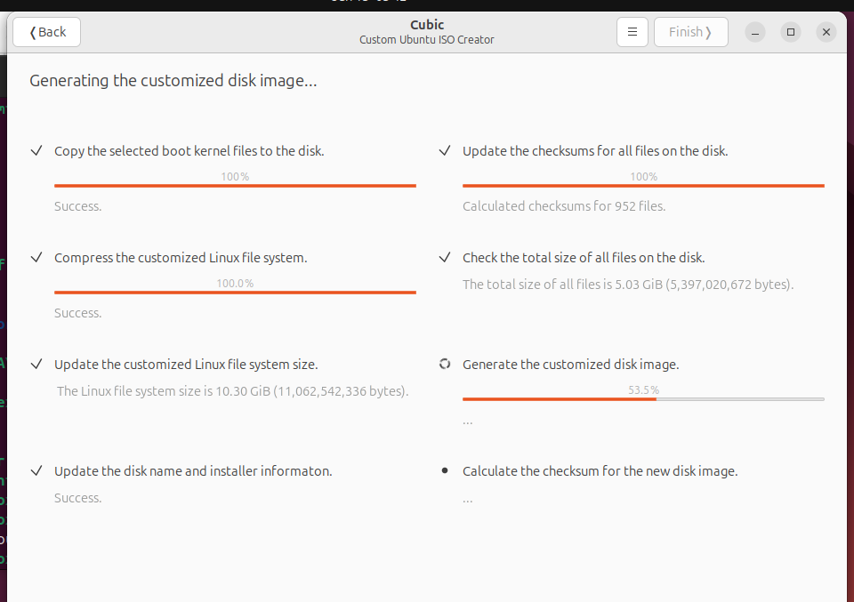
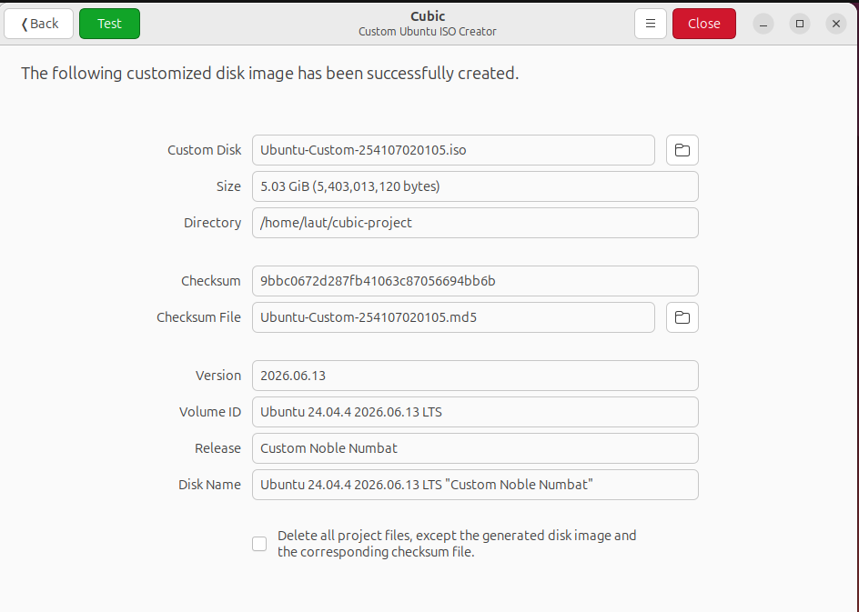

# Laporan Remastering Distribusi Linux Berbasis Ubuntu

**Nama**: Surya Sadikin Firdaus
**NIM**: 254107020105
**Mata Kuliah**: Sistem Operasi

---

## 1. Pendahuluan

Pada tugas ini, dilakukan proses _remastering_ terhadap distribusi Linux berbasis Ubuntu menggunakan tool **Cubic (Custom Ubuntu ISO Creator)**. Proses remastering meliputi penambahan aplikasi kustom, perubahan tampilan antarmuka, serta pembuatan file ISO baru hasil modifikasi.

## 2. Persiapan Sistem Dasar

- **ISO Ubuntu yang digunakan**: Ubuntu 24.04.4 LTS
- **Tool remastering**: Cubic versi [versi]
- **Spesifikasi sistem host**:
  - OS: Windows 10
  - RAM: 12
  - Storage: 512GB
- **Spesifikasi sistem vm**:
  - OS: Ubuntu 24.04.4 LTS
  - RAM: 6 GB
  - Storage: 80 GB

## 3. Kustomisasi dan Instalasi Aplikasi

Berikut aplikasi yang ditambahkan ke dalam sistem hasil remaster:
1. VLC Media Player
2. GIMP
3. Apache2 + PHP
4. Visual Studio Code
5. Aplikasi Kustom (Bash Script)

### 3.1 Aplikasi Kustom Buatan Sendiri (Bash Script)

Aplikasi kustom berupa skrip Bash yang menampilkan informasi dasar perangkat keras komputer, meliputi:

- Informasi CPU
- Kapasitas dan penggunaan memori (RAM)
- Kapasitas ruang penyimpanan (Storage)

**Source code (`sysinfo.sh`):**

```
#!/bin/bash

RED='\033[0;31m'
GREEN='\033[0;32m'
CYAN='\033[0;36m'
YELLOW='\033[1;33m'
BOLD='\033[1m'
NC='\033[0m'

TL='┌'; TR='┐'; BL='└'; BR='┘'; H='─'; V='│'; LM='├'; RM='┤'

WIDTH=60

draw_top()    { echo -e "${CYAN}${TL}$(printf '%.0s'"$H" $(seq 1 $WIDTH))${TR}${NC}"; }
draw_mid()    { echo -e "${CYAN}${LM}$(printf '%.0s'"$H" $(seq 1 $WIDTH))${RM}${NC}"; }
draw_bot()    { echo -e "${CYAN}${BL}$(printf '%.0s'"$H" $(seq 1 $WIDTH))${BR}${NC}"; }

draw_title() {
    local title=$1
    local pad_total=$(( WIDTH - ${#title} ))
    local pad_left=$(( pad_total / 2 ))
    local pad_right=$(( pad_total - pad_left ))
    printf "${CYAN}${V}${NC}${BOLD}%${pad_left}s%s%${pad_right}s${NC}${CYAN}${V}${NC}\n" "" "$title" ""
}

draw_row() {
    local label=$1 value=$2
    local content
    content=$(printf "%-20s : %s" "$label" "$value")
    local visible_len=${#content}
    local pad=$(( WIDTH - visible_len - 2 ))
    printf "${CYAN}${V}${NC} ${YELLOW}%-20s${NC} : ${GREEN}%s${NC}%${pad}s${CYAN}${V}${NC}\n" "$label" "$value" ""
}

clear
echo ""
draw_top
draw_title "SYSTEM INFORMATION"
draw_mid

CPU_MODEL=$(grep -m1 'model name' /proc/cpuinfo | cut -d: -f2 | xargs)
CPU_CORES=$(nproc)
CPU_USAGE=$(top -bn1 | grep "Cpu(s)" | awk '{print $2}')
draw_row "CPU Model" "$CPU_MODEL"
draw_row "CPU Cores" "$CPU_CORES"
draw_row "CPU Usage" "${CPU_USAGE}%"
draw_mid

TOTAL_RAM=$(free -h | awk '/Mem:/{print $2}')
USED_RAM=$(free -h | awk '/Mem:/{print $3}')
FREE_RAM=$(free -h | awk '/Mem:/{print $4}')
draw_row "Total RAM" "$TOTAL_RAM"
draw_row "Used RAM" "$USED_RAM"
draw_row "Free RAM" "$FREE_RAM"
draw_mid

TOTAL_DISK=$(df -h / | awk 'NR==2{print $2}')
USED_DISK=$(df -h / | awk 'NR==2{print $3}')
FREE_DISK=$(df -h / | awk 'NR==2{print $4}')
USAGE_PCT=$(df -h / | awk 'NR==2{print $5}')
draw_row "Total Storage" "$TOTAL_DISK"
draw_row "Used Storage" "$USED_DISK"
draw_row "Free Storage" "$FREE_DISK"
draw_row "Usage" "$USAGE_PCT"
draw_bot
echo ""
```

**Cara penggunaan:**

1. Simpan skrip ke `/usr/local/bin/sysinfo.sh`
2. Berikan izin eksekusi: `chmod +x /usr/local/bin/sysinfo.sh`
3. Jalankan dengan perintah: `sysinfo.sh`
4. Hasil Penggunaa:


## 4. Kustomisasi Tampilan (Antarmuka)

Perubahan visual yang dilakukan pada Desktop Environment bawaan:
* Sebelum:


* Sesudah:


## 5. Pembuatan File ISO# Laporan Remastering Distribusi Linux Berbasis Ubuntu

Langkah-langkah:
1. Masuk ke dalam Ubuntu Linux


2. Buka Cubic


3. Masukkan iso yang ingin diremaster dan ubah nama hasil iso remaster (jika mau)


4. Tunggu meng-extract iso


5. Install semua aplikasi dan customisasi yang diinginkan


6. Tekan next dan tunggu untuk build iso baru


7. Selesai!!
