# Laporan Praktikum Sistem Operasi Jobsheet 1

<h4>Nama : Surya Sadikin Firdaus<h4>
<h4>NIM : 254107020105<h4>
<h4>Kelas : TI-1H<h4>

## 1.10. Latihan

### 1.10.1 Latihan Konseptual

#### Pertanyaan Latihan 1.1
Jelaskan 5 fungsi utama sistem operasi dengan contoh konkret dari minimal 2 OS berbeda (Windows, macOS, Linux).

#### Jawaban Latihan 1.1
1. Windows
    * Mengelola perangkat keras agar dapat bekerja bersama secara optimal
    * Menyediakan platform untuk menjalankan aplikasi
    * Mengorganisir sistem file sehingga mudah digunakan oleh pengguna melalu File Explorer
    * Menyediakan antarmuka grafis yang membuat interaksi dengan komputer menjadi lebih intuitif
    * Mendukung konektivitas jaringan, internet, serta berbagi data antar perangkat di rumah atau kantor

2. macOS
    * macOS berperan dalam menghidupkan dan memulai ulang komputer
    * Dengan GUI yang moder, macOS memungkinkan penguna berinteraksi dengan sistem melalui ikon, jendela, dan menu
    * macOS secara otomatis mengatur penggunaan perangkat keras agar sistem tetap berjalan optimal tanpa membebani performa komputer
    * macOS memungkinkan komputer untuk terhubung ke jaringa, berbagi file, dan mengakses sumber daya lain dalam lingkungan kerja atau pribadi 
    * macOS mengatur waktu dan ururtan eksekusi berbagai proses di komputer, memastikan efisiensi dalam penggunaan sumber daya

#### Pertanyaan Latihan 1.2
Kapan sebaiknya menggunakan Windows vs Linux vs macOS? analisis berdasarkan use case: gaming, development, server, creative work, dan enterprise.

#### Jawaban Latihan 1.2
Jika ingin memiliki pengalaman bermain game yg baik maka gunakanlah Windows. Jika kamu bekerja dalam bidang kreativitas dan memerlukan ekosistem yang terintegrasi baik maka gunakan macOS. Dan jika ingin melakukan pengembangan server, perangkat lunak, dan ingin memiliki OS yang punya tingkat keamanan tinggi maka gunakanlah Linux

### 1.10.2 Latihan Praktikal

#### Pertanyaan Latihan 1.3
Install Ubuntu Server 22.04 LTS di VirtualBox dengan langkah berikut:
1. Download Ubuntu Server ISO dari website resmi
2. Create VM baru di VirtualBox (RAM: 2GB, Disk: 25GB)
3. Install dengan automatic partitioning (guided)
4. Buat user account dengan password yang kuat
5. Reboot dan login ke sistem
6. Dokumentasikan proses instalasi dengan screenshot key steps

#### Jawaban Latihan 1.3
1. Download Ubuntu Server
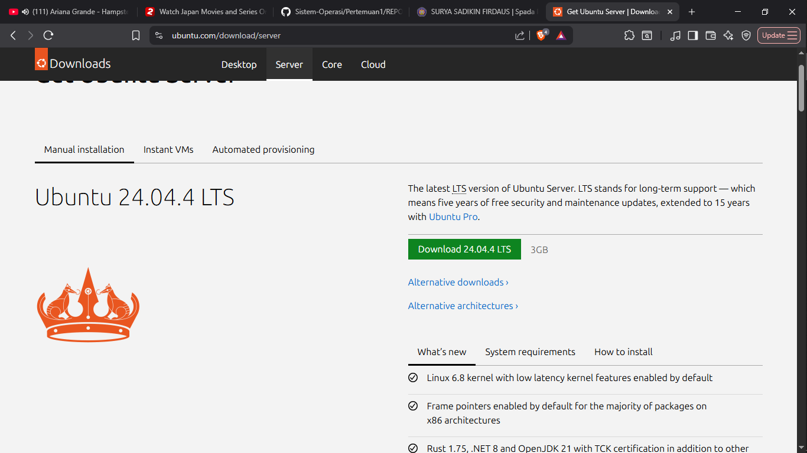

2. Login menggunakan username dan password yang telah dibuat
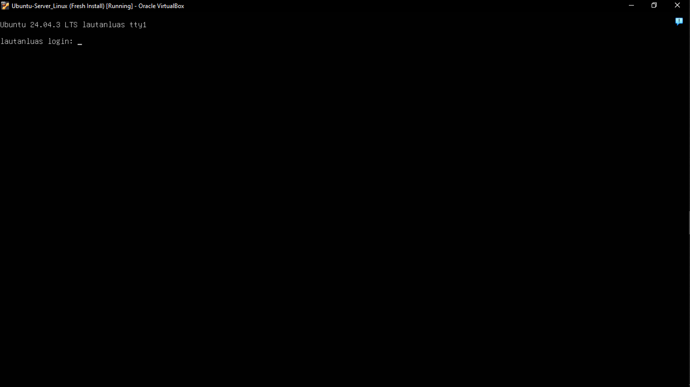

3. Tampilan neofetch
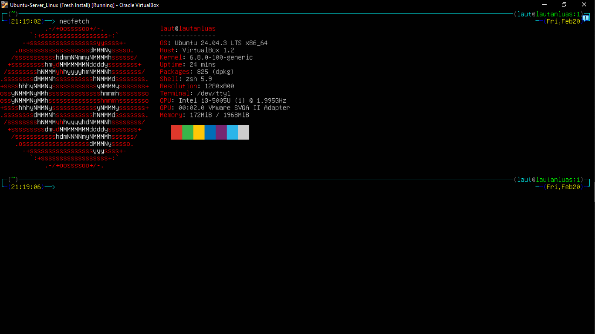

#### Pertanyaan Latihan 1.4
Setelah instalasi Ubuntu Server, lakukan tasks berikut:
1. Update package list: sudo apt update
2. Upgrade packages: sudo apt upgrade
3. Install neofetch: sudo apt install neofetch
4. Jalankan neofetch dan screenshot hasilnya
5. Check disk usage dengan df -h
6. Check memory dengan free -h
7. Dokumentasikan output dari setiap command

#### Jawaban Latihan 1.4
1. 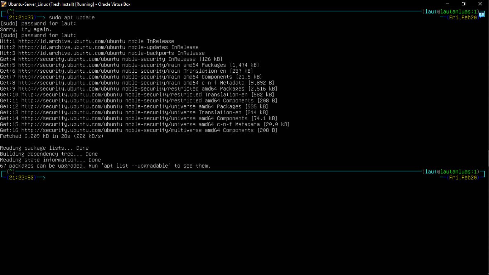
2. 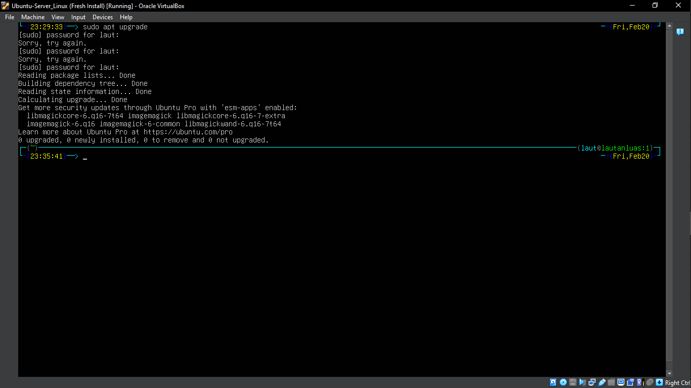
3. 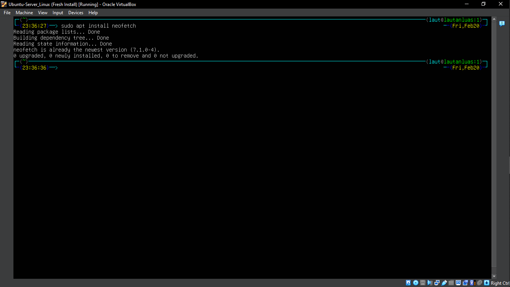
4. 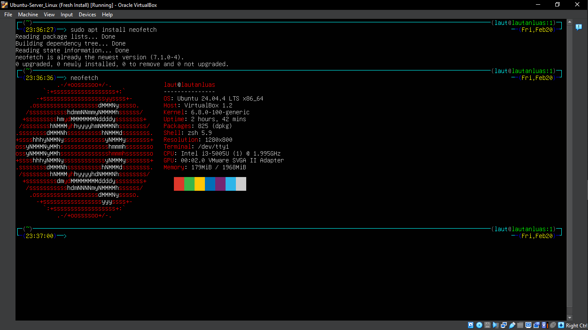
5. 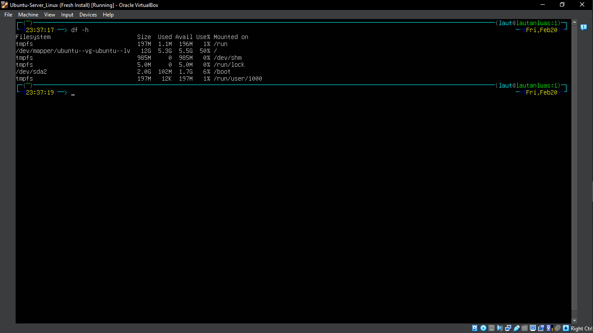
6. 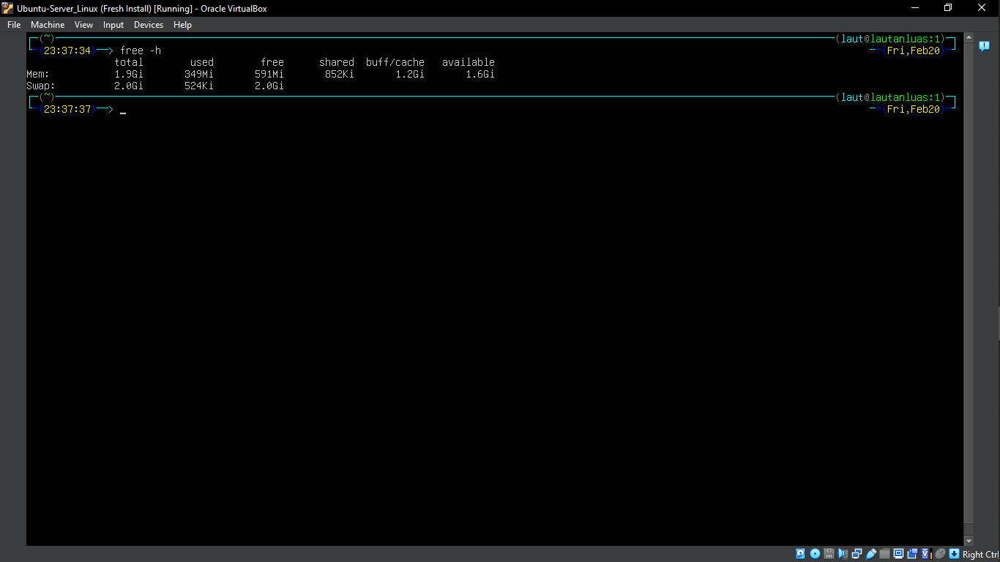

#### Pertanyaan Latihan 1.5
Eksplorasi sistem yang baru diinstall:
1. Tampilkan informasi OS: cat /etc/os-release
2. Tampilkan versi kernel: uname -r
3. List partisi: lsblk
4. Check network connectivity: ping -c 4 google.com
5. Install dan jalankan htop untuk melihat resource usage
6. Buat laporan singkat tentang konfigurasi sistem Anda

#### Jawaban Latihan 1.5
1. 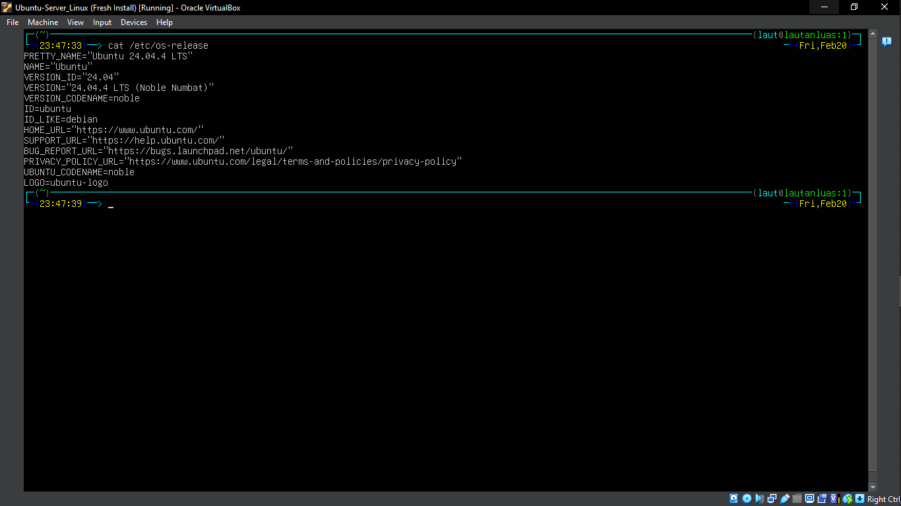
2. 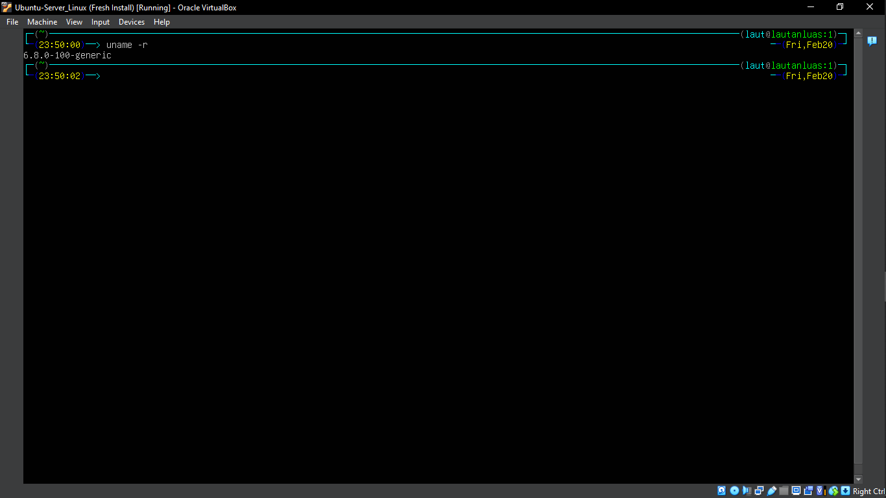
3. 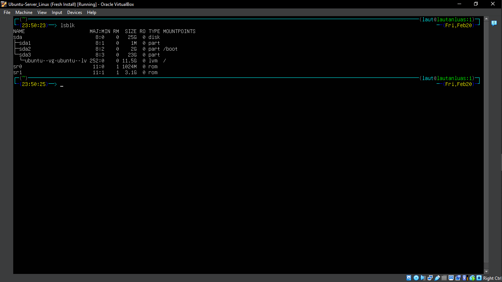
4. 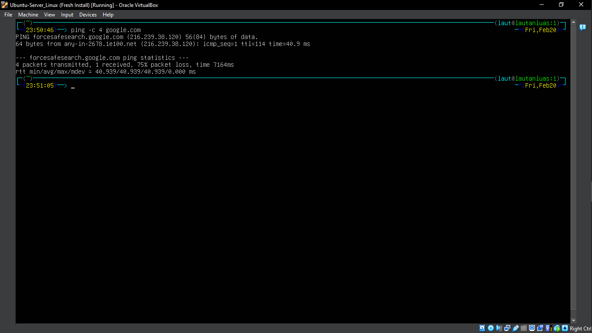
5. 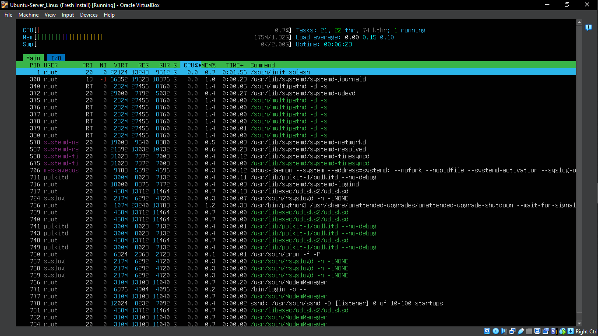
6.  * OS                = Ubuntu 24.04.4 LTS
    * Kernel Version    = 6.8.0-100-generic
    * Storage           = HDD 25GB
    * Network           = Terhubung ke internet, ping ke google rata-rata 180ms
    * htop              = RAM terpakai 159MB dari 1.92GB, CPU idle 1,4%

### 1.10.3 Latihan Refleksi

#### Pertanyaan Latihan 1.6
Ceritakan pengalaman Anda dengan sistem operasi:
1. Sistem operasi apa yang Anda gunakan sehari-hari? (Windows, macOS,
Linux, atau lainnya)
2. Berapa lama Anda menggunakan sistem operasi tersebut?
3. Apa yang Anda sukai dari sistem operasi tersebut?
4. Apa tantangan atau masalah yang pernah Anda hadapi?
5. Apakah Anda pernah menggunakan sistem operasi lain? Bandingkan
pengalaman Anda.
6. Setelah mempelajari bab ini, apakah ada sistem operasi lain yang ingin
Anda coba? Mengapa?
Tulis refleksi Anda dalam 300-500 kata disertai dengan dokumentasi.

#### Jawaban Latihan 1.6
Saya menggunakan sistem operasi Windows. Saya telah menggunakan Windows sejak umur saya sekitar 6 Tahun, jadi sudah terhitung 14 tahun saya menggunakan Windows. Versi Windows pertama yang saya gunakan ialah Windows XP yang dipasang di dalam computer ayah saya. Pada tahun 2014 saya mulai menggunakan Windows 7 yang dipasang di dalam computer rumah saya. Saat saya SMP saya mulai menggunakan Windows 10 yang dipasang di dalam computer saya dan Windows 8 yang dipasang di dalam laptop kakak saya. Dan sekarang saya menggunakan sistem operasi Windows 10 untuk keseharian saya. 

Hal yang saya sukai terhadap sistem operasi Windows adalah kemudahannya untuk memasang aplikasi bajakan. Hal ini saya lakukan hanya untuk edukasi semata, saya ingin tahu bagaimana langkah kerja memasang program bajakan yang sering tersebar di internet. 
Tantangan atau masalah yang pernah saya hadapi saat menggunakan Windows adalah kerentanan Windows terkena virus. Contoh nyatanya adalah saat ayah saya ingin mendownload software pendukung untuk pekerjaannya, namun malangnya ayah saya salah menekan link dan malah berakhir mendownload ransomware. Saat itu kami bertiga –ayah saya, saya, dan kakak saya—pusing selama 2 hari. Akhirnya karena kami tidak tahu apa yang harus dilakukan, kami memutuskan untuk menginstall ulang sistem operasi Windows 10 di laptop ayah saya. 

Saya pernah mencoba menggunakan sistem operasi lain, yaitu macOS. Saya mencoba menggunakan macOS saat berada di bangku kuliah, lebih tepatnya saat membantu teman saya. Perbedaan yang paling terasa adalah banyak keybind atau tombol yang berbeda dengan Windows. Kehalusan saat berpindah antar aplikasi juga terasa lebih halus di macOS. Namun, jika ingin menginstal software bajakan, lebih susah menginstal software bajakan di macOS daripada di Windows.

Saya ingin mempelajari mengenai sistem operasi linux, lebih tepatnya Kali Linux dan Arch Linux. Alasan saya ingin mempelajari dan mencoba kedua sistem operasi itu adalah karena saya ingin tahu kegunaan kedua sistem operasi tersebut. Saya sering melihat di YouTube maupun Tiktok bahwa kedua OS tersebut bagus untuk melakukan hacking maupun software developing. Dan karena saya sedang berkuliah di jurusan Teknik Informatika, karena itu juga saya ingin mengeksplor kedua OS itu.

OS yang saya gunakan sekarang:
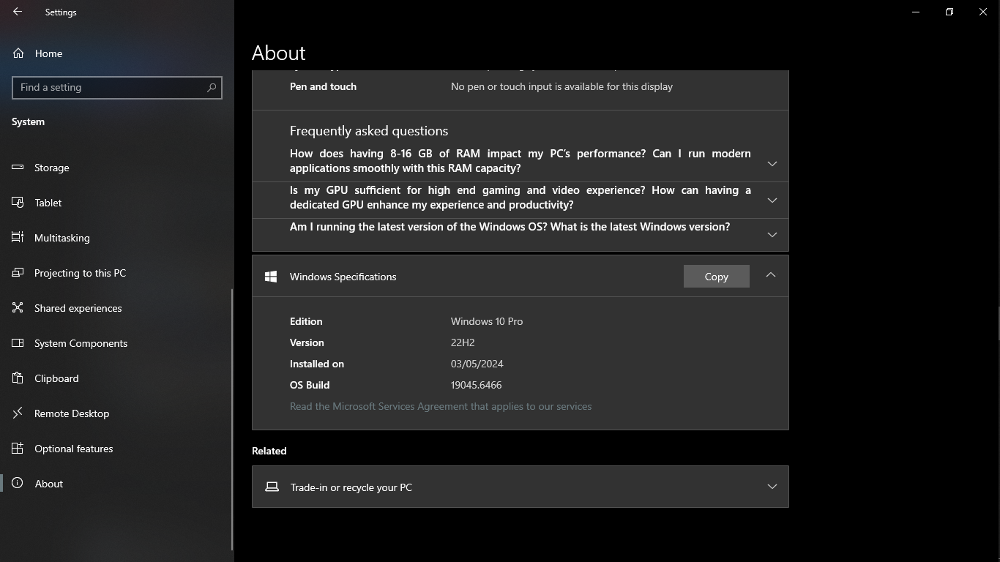
