# Laporan Praktikum Sistem Operasi Minggu 10

<h4>Nama : Surya Sadikin Firdaus<h4>
<h4>NIM : 254107020105<h4>
<h4>Kelas : TI-1H<h4>

## Tugas Praktikum 1 - Melihat Penggunaan Memori
1. Jalankan free-h untuk elihat ringakasan RAM dan swap:
```
free -h
```
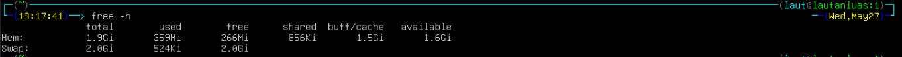

2. Lihat detail memori dari kernel melalui /proc/meminfo:
```
cat /proc/meminfo | head -n 20
```
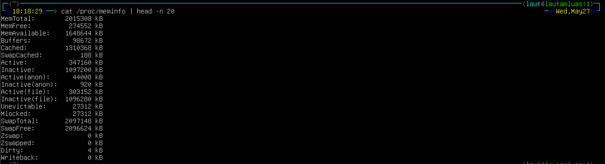

### Studi Kasus 10.1
**Skenario:** Server aplikasi terasa lambat saat banyak pengguna aktif. Administrator perlu menentukan apakah penyebabnya adalah kekurangan memori.

**Langkah 1:** periksa kondisi memori secara keseluruhan
```
free -h
```
**Langkah 2:** Pantau proses secara real time
```
top
```

Di dalam top: tekan M untuk mengurutkan berdasarkan memori, tekan q untuk keluar.

**Analisis:**
1. Apakah nilai available sangat kecil (misalnya di bawah 200 MB pada server dengan RAM 2 GB)? Jika ya, server kemungkinan kekurangan memori.
2. Apakah kolom used pada baris Swap lebih dari 0? Jika ya, kernel sedang menggunakan swap, yang berarti performa menurun.
3. Di tampilan top, proses apa yang memiliki %MEM terbesar? Proses tersebut menjadi kandidat utama penyebab lambatnya server.

### Jawaban Studi Kasus 10.1

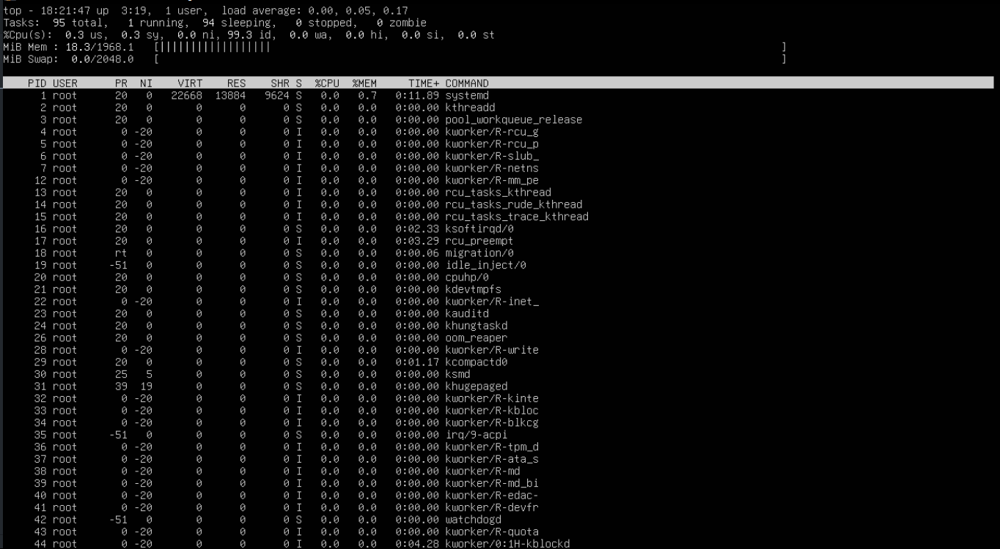
1. Memori tidak kekurangan
2. Swap used = 524Ki, lebih dari 0 tapi tidak berdampak signifikan 
3. systempd memiliki %MEM yang paling besar


## Praktikum 2 - Mengamati Aktivitas Paging
1. Jalankan vmstat dengan interval 1 detik, 5 sampel:
```
vmstat 1 5
```
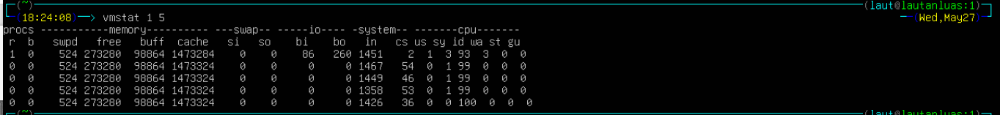

### Pertanyaan Analisis 9.2
1. Amati nilai si dan so pada kelima baris. Pada sistem normal dengan RAM cukup, kedua nilai ini selalu 0.
2. Jika nilai si atau so sesekali muncul lebih dari 0, artinya pernah ada aktivitas swap. Ini masih wajar jika tidak terus-menerus.
3. Jika si dan so terus-menerus lebih dari 0, sistem dalam kondisi memory pressure serius — performa turun drastis karena akses disk jauh lebih lambat dari RAM.
4. Perhatikan juga kolom free(RAM kosong) dan buff(buffer) untuk memahami kondisi keseluruhan RAM saat itu.

### Jawaban Analisis 9.2
1. si dan so = 0 semua baris. Normal.
2. Tidak ada si/so > 0. Tidak pernah ada aktivitas swap.
3. si/so tidak terus-menerus > 0. Tidak ada memory pressure serius.
4. free = 273280, stabil. buff = 98864, stabil. RAM kondisi baik.


## Praktikum 3 - Membuat dan Mengonfigurasi Swap File
1. Buat file berukuran 512 MB sebagai calon swap:
```
sudo fallocate -l 512M /swapfile-week10
```
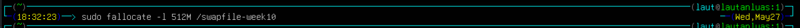

2.  Atur permission file menjadi 600— hanya root yang boleh membaca dan menulis: 
```
sudo chmod 600 /swapfile-week10
```


3. Format file sebagai area swap, lalu aktifkan:
```
sudo mkswap /swapfile-week10
sudo swapon /swapfile-week10
```
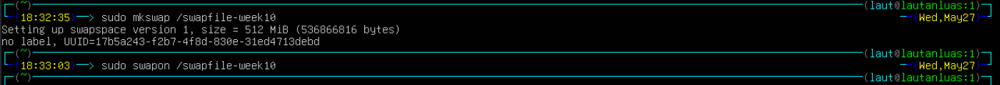

4. Verifikasi swap aktif. Anda akan melihat entri /swapfile-week10 dengan ukuran 512M, dan nilai total pada baris Swap di free -h bertambah 512M.: 
```
swapon --show
free -h
```
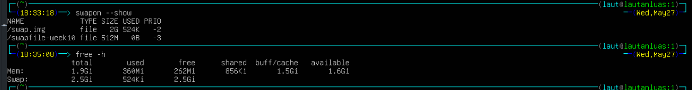

5. Periksa nilai swappiness, ubah sementara, dan verifikasi perubahan:
```
cat /proc/sys/vm/swappiness
sudo sysctl vm.swappiness=10
cat /proc/sys/vm/swappiness
```
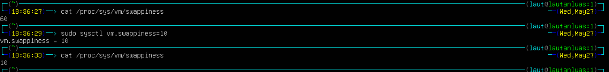


### Pertanyaan Analisis 9.3
1. Berapa nilai swappiness default? Apa artinya bagi perilaku kernel dalam menggunakan swap?
2. Setelah diubah ke 10, konfirmasi nilai berubah pada output cat kedua. Apa dampak nilai 10 terhadap penggunaan swap dibanding nilai 60?
3. Apakah entri /swapfile-week10 muncul di swapon –show? Jika tidak, pastikan Langkah 2 (chmod 600) sudah dijalankan sebelum Langkah 3.

### Jawaban Analisis 9.3
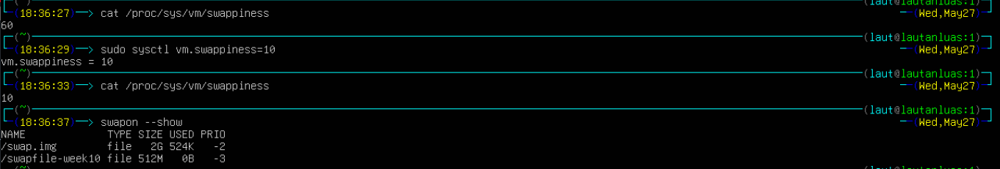
1. Nilai default adalah 60. Artinya kernel cukup agresif memindahkan data ke swap meski RAM masih ada.
2. Nilai berhasil berubah ke 10. Kernel jadi lebih malas pakai swap. Swap hanya dipakai jika RAM benar-benar hampir habis.
3. /swapfile-week10 muncul di swapon --show. Swap aktif, size 512M, used 0B.

## Praktikum 4 - Monitoring Memori
1. Ambil snapshot proses diurutkan dari penggunaan memori terbesar:
```
ps aux --sort=-%mem | head
```
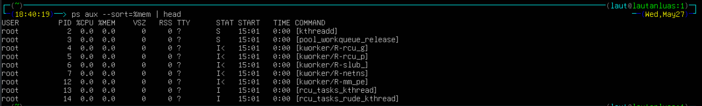

2. Pantau secara real-time dengan top:
```
top
```
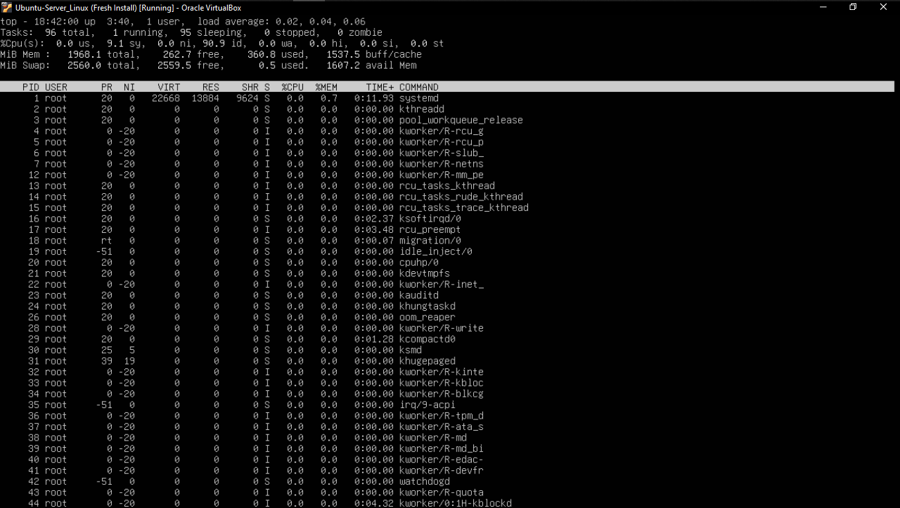

### Pertanyaan Analisis 9.4
1. Proses apa yang berada di urutan pertama? Catat nilai %MEM dan RSS-nya.
2. Konversikan RSS dari KB ke MB (bagi 1024). Misalnya, RSS=524288 berarti proses menggunakan 512 MB RAM. Apakah wajar untuk jenis program tersebut?
3. Mengapa VSZ selalu lebih besar dari RSS pada proses yang sama?
4. Apakah urutan proses di ps konsisten dengan tampilan top saat diurutkan berdasarkan %MEM?

### Jawaban Analisis 9.4
1. Urutan pertama: multipathd. %MEM = 1.3, RSS = 27320 KB.
2. RSS = 27320 ÷ 1024 = 26.7 MB. Wajar untuk multipathd (daemon manajemen storage).
3. VSZ = semua memori yang dialokasikan (termasuk belum dipakai). RSS = memori yang benar-benar dipakai sekarang. VSZ selalu lebih besar karena tidak semua alokasi langsung digunakan.
4. Konsisten. Urutan teratas di ps sama dengan top saat diurutkan M — multipathd paling banyak pakai memori.

## Praktikum 5 - Script Monitor Memori
1. Masuk ke direktori kerja dan buat file script:
```
cd ~/praktikum-os/week10-memory
nano monitor-memori.sh
```
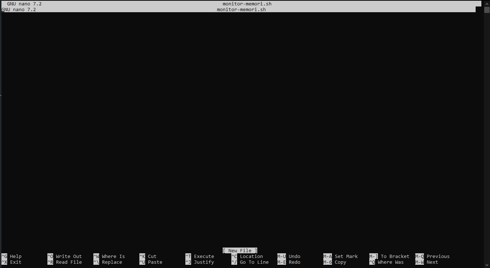

2. Ketik script berikut:
```
#!/bin/bash
set -euo pipefail

THRESHOLD=20

echo "=== Monitor Memori ==="
date
echo

free -h
echo

AVAIL=$(free | awk '/Mem/ {printf "%d", $7/$2*100}')
if [ "$AVAIL" -lt "$THRESHOLD" ]; then
    echo "PERINGATAN: Memori tersedia hanya ${AVAIL}%!"
else
    echo "Status: Memori tersedia ${AVAIL}% (normal)"
fi
echo

echo "--- 5 Proses Memori Tertinggi ---"
ps aux --sort=-%mem | head -n 6 | tail -n 5
```
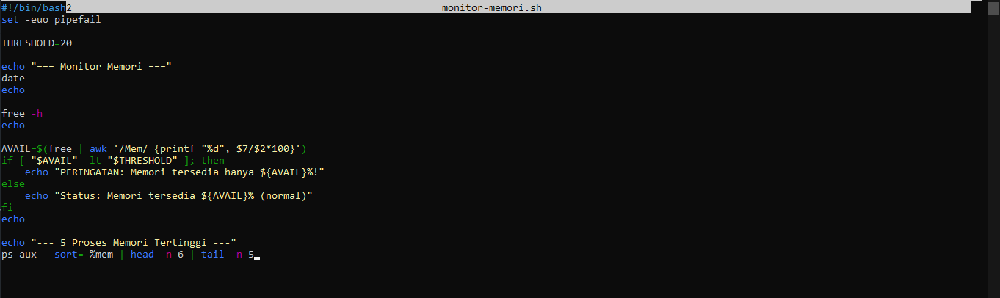

### Pertanyaan Studi Kasus 10.2
Skenario: Program tidak dapat membaca file konfigurasi. Penyebab umum: file tidak ada, path salah, atau permission tidak sesuai. Kita akan mensimulasikan kondisi ini dan mengamati pesan error yang dihasilkan.

**Langkah 1:** Buat direktori dan file konfigurasi contoh
```
mkdir -p ~/praktikum-os/week10-memory/syscall-case
cd ~/praktikum-os/week10-memory/syscall-case
echo "PORT=8080" > app.conf
ls -l app.conf
cat app.conf
```
**Langkah 2:** Simulasikan permission bermasalah
```
chmod 000 app.conf
cat app.conf
```
Output akan menampilkan: cat: app.conf: Permission denied. Ini terjadi karena system call openat() gagal — kernel menolak permintaan membuka file karena tidak ada bit izin baca (r).

**Langkah 3:** Kembalikan permission dan verifikasi
```
chmod 644 app.conf
cat app.conf
```

**Analisis:**
1. Mengapa cat menghasilkan Permission denied setelah chmod 000? System call apa yang gagal?
2. Apa perbedaan pesan error Permission denied vs No such file or directory? Coba rm app.conf lalu cat app.conf untuk melihat perbedaannya.
3. Permission 644 berarti apa untuk owner, group, dan others?

### Jawaban Studi Kasus 10.2
1. chmod 000 menghapus semua permission, sehingga system call open() gagal karena tidak ada bit r untuk siapapun.
2. Permission denied berarti file ada tapi tidak bisa diakses. No such file or directory berarti file memang tidak ada di filesystem.
3. 644 berarti owner bisa baca dan tulis, sedangkan group dan others hanya bisa baca.


## Praktikum 6: Mengamati System Call dengan strace

1.  Lihat 30 baris pertama system call dari perintah ls:
```
strace ls 2>&1 | head -n 30
```
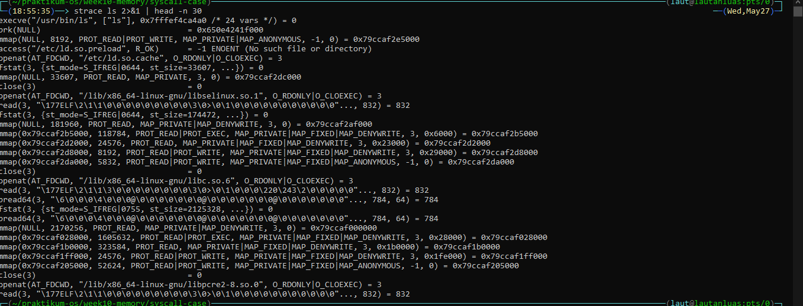

2. Lihat ringkasan statistik dan bandingkan dua direktori berbeda:
```
strace -c ls
strace -c ls /etc 2>&1 | tail -5
```
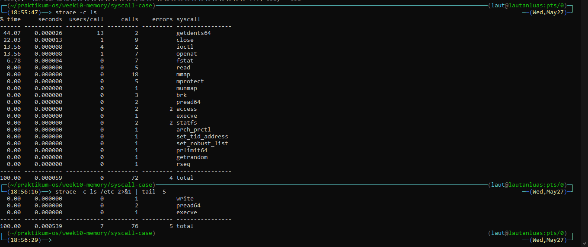

3. Cek sintaks, lalu jalankan dengan tracing:
```
chmod +x ~/praktikum-os/week09/scripts/debug-latihan.sh
bash -n debug-latihan.sh && echo "Sintaks OK"
bash -x debug-latihan.sh /etc 10
./debug-latihan.sh /var 50
./debug-latihan.sh
```
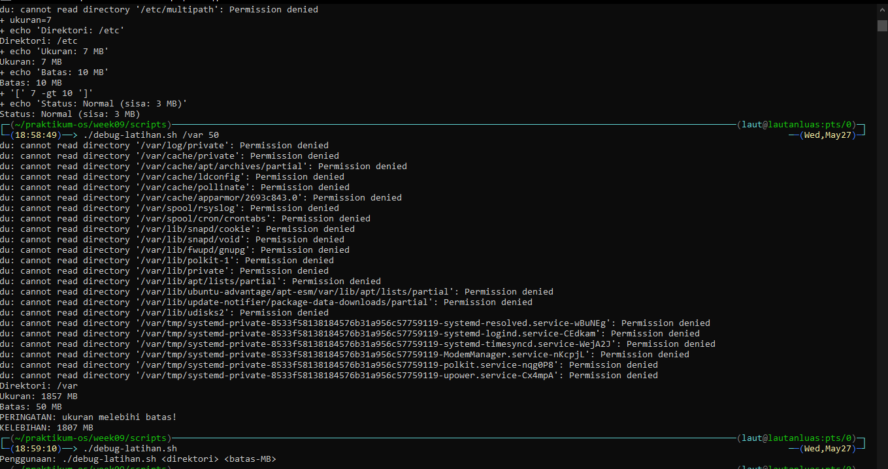


## Tugas Praktikum
1. Tugas 10.1 Audit Penggunaan Memori Sistem
Konteks: instruktur mencatat kehadiran mahasiswa dari command line
Intruksi:
    a. Buat script absensi.sh yang:
        - Menerima argumen nama mahasiswa dan status (hadir/izin.alpha)
        - Menympan enyti ke absensi-YYYY-MM-DD.txt dengan format [HH:MM] NAMA - STATUS
        - Opsi -r: tampilkan rekapitulasi (jumlah per status)
        - Opsi -h: tampilkan bantuan
    
    b. Rekam minimal 5 entri dan tampilkan rekapitulasinya
Konsep wajib: variabel, parameter posisional, getopts, if, for, fungsi, dan redirection ke file

```
#!/bin/bash
# absensi.sh - Script absensi kelas

FILE="absensi-$(date +%Y-%m-%d).txt"

bantuan() {
    echo "Penggunaan: $0 [opsi] [nama] [status]"
    echo ""
    echo "Status: hadir | izin | alpha"
    echo ""
    echo "Opsi:"
    echo "  -r    Tampilkan rekapitulasi"
    echo "  -h    Tampilkan bantuan ini"
}

rekapitulasi() {
    if [ ! -f "$FILE" ]; then
        echo "Belum ada data absensi hari ini."
        exit 0
    fi

    echo "=== Rekapitulasi: $FILE ==="
    echo "Hadir : $(grep -c "HADIR" "$FILE" 2>/dev/null || echo 0)"
    echo "Izin  : $(grep -c "IZIN" "$FILE" 2>/dev/null || echo 0)"
    echo "Alpha : $(grep -c "ALPHA" "$FILE" 2>/dev/null || echo 0)"
    echo "Total : $(wc -l < "$FILE")"
}

catat_absensi() {
    local nama="$1"
    local status="$2"

    # validasi status
    case "$status" in
        hadir|izin|alpha) ;;
        *)
            echo "ERROR: Status tidak valid. Gunakan: hadir / izin / alpha" >&2
            exit 1
            ;;
    esac

    local waktu=$(date +%H:%M)
    local status_upper=$(echo "$status" | tr '[:lower:]' '[:upper:]')

    echo "[$waktu] $nama - $status_upper" >> "$FILE"
    echo "Tercatat: [$waktu] $nama - $status_upper"
}

# --- parse opsi ---
while getopts "rh" opt; do
    case "$opt" in
        r) rekapitulasi; exit 0 ;;
        h) bantuan; exit 0 ;;
        *) bantuan; exit 1 ;;
    esac
done

shift $((OPTIND - 1))

# --- cek argumen ---
if [ $# -ne 2 ]; then
    bantuan
    exit 1
fi

catat_absensi "$1" "$2"

# --- auto rekap kalau sudah 5 entri ---
total=$(wc -l < "$FILE")
if [ "$total" -ge 5 ]; then
    echo ""
    rekapitulasi
fi
```
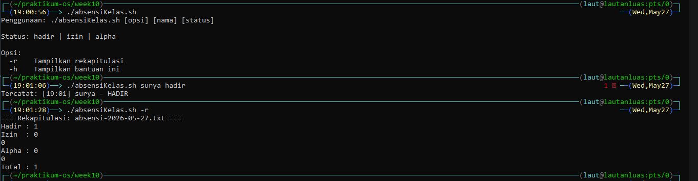


2. Tugas 2 Script Health Check Sistem
Konteks: administrator membuat pemeriksaan kaondisi server sebelum maintenance
Intruksi: 
    a. Buat script healthcheck.sh menggunakan template profesional dari bagian Best Practices.
    b. Script menampilkan: tanggal/waktu, hostname, uptime, penggunaan CPU, memori, dan disk untuk setiap filesystem yang terpasang.
    c. Jika penggunaan disk mana pun melebihi 80%, tampilkan peringatan.
    d. Simpan hasil ke healthcheck-YYYY-MM-DD.log dan tampilkan ke terminal sekaligus menggunakan tee.
    e. Opsi -t <persen> mengubah batas peringatan disk (default 80).
Konsep wajib: set -euo pipefail, trap, getopts, fungsi dengan local, for, if, dan tee
```
#!/bin/bash
# =================================================
# Script: healthcheck.sh
# Deskripsi: Pemeriksaan kondisi sistem sebelum maintenance
# Penggunaan: ./healthcheck.sh [-v] [-h] [-t <persen>]
# =================================================

SCRIPT_NAME=$(basename "$0")
VERBOSE=false
BATAS=80
LOGFILE="healthcheck-$(date +%Y-%m-%d).log"

usage() {
    echo "Penggunaan: $SCRIPT_NAME [-v] [-h] [-t <persen>]"
    echo "  -v  Verbose mode"
    echo "  -h  Tampilkan bantuan"
    echo "  -t  Batas peringatan disk (default: 80)"
    exit 0
}

log() {
    echo "[$SCRIPT_NAME] $*" | tee -a "$LOGFILE"
}

log_verbose() {
    if [ "$VERBOSE" = true ]; then
        log "$*"
    fi
}

error_exit() {
    echo "ERROR: $*" >&2
    exit 1
}

cleanup() {
    log_verbose "Cleanup selesai."
}

trap cleanup EXIT

cek_cpu() {
    local cpu
    cpu=$(awk '/^cpu / {idle=$5; total=0; for(i=2;i<=NF;i++) total+=$i; printf "%.1f", 100-(idle/total*100)}' /proc/stat)
    log "CPU Usage   : ${cpu}%"
}

cek_memori() {
    local total used persen
    total=$(free -m | awk '/Mem:/ {print $2}')
    used=$(free -m | awk '/Mem:/ {print $3}')
    persen=$(( used * 100 / total ))
    log "Memory      : ${used}MB / ${total}MB (${persen}%)"
}

cek_disk() {
    log "Disk Usage  :"
    while read -r persen mount; do
        if [ "$persen" -gt "$BATAS" ]; then
            log "  [PERINGATAN] $mount - ${persen}% (melebihi ${BATAS}%)"
        else
            log "  [OK] $mount - ${persen}%"
        fi
    done < <(df -h | tail -n +2 | awk '{gsub(/%/,"",$5); print $5, $6}')
}

while getopts "vht:" OPSI; do
    case $OPSI in
        v) VERBOSE=true ;;
        h) usage ;;
        t) BATAS="$OPTARG" ;;
        *) error_exit "Opsi tidak dikenal. Gunakan -h." ;;
    esac
done
shift $((OPTIND - 1))

log "Script dimulai"
log_verbose "Batas disk: ${BATAS}%"
log "======================================"
log " Tanggal  : $(date '+%Y-%m-%d %H:%M:%S')"
log " Hostname : $(hostname)"
log " Uptime   : $(uptime -p)"
log "======================================"
cek_cpu
cek_memori
cek_disk
log "======================================"
log "Selesai."
```
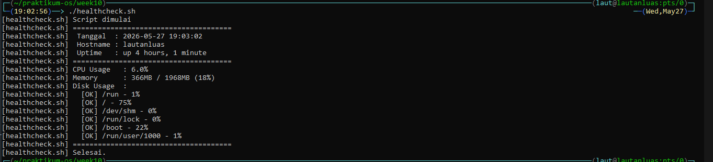