# Laporan Praktikum Sistem Operasi Jobsheet 11

<h4>Nama : Surya Sadikin Firdaus<h4>
<h4>NIM : 254107020105<h4>
<h4>Kelas : TI-1H<h4>

## Praktikum 1 -  Permissions
1. Buat direktori kerja dan dua file uji:
```
mkdir ~/lab-permissions && cd ~/lab-permissions
echo "data rahasia" > secret.txt
echo '#!/bin/bash' > myscript.sh
echo 'echo Hello' >> myscript.sh
ls -la
```
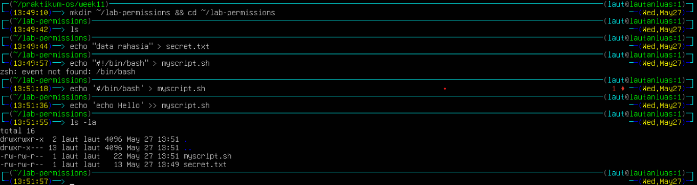

2. Jadikan secret.txt privat hanya untuk owner:
```
chmod 600 secret.txt
ls -l secret.txt
```
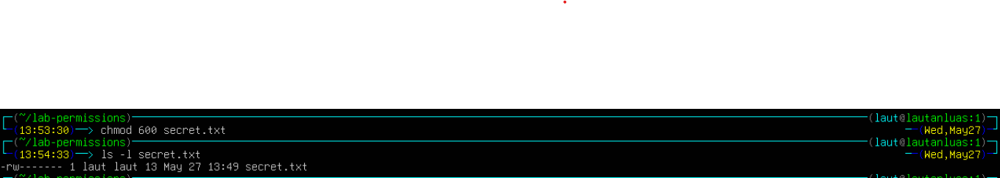

3. Jadikan myscript.sh dapat dijalankan:
```
chmod 755 myscript.sh
ls -l myscript.sh
./myscript.sh
```
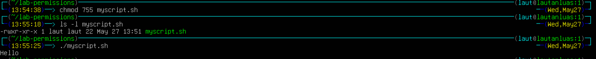

4. Buat direktori bersama dan amati efek SGID sederhana:
```
mkdir shared-dir
chmod g+s shared-dir
ls -ld shared-dir
```
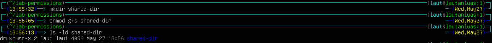

5. Uji efek umask pada file baru:
```
umask
umask 027
touch testfile-027
ls -l testfile-027
```
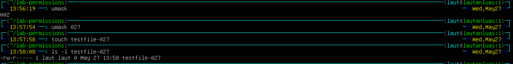

### Pertanyaan Latihan 9.1
1. Mengapa secret.txt tidak dapat dibaca oleh group dan others setelah chmod 600?
2. Apa perbedaan arti 600 dan 755 terhadap file yang diuji?
3. Setelah umask 027, permission apa yang dihasilkan untuk file baru, dan mengapa bukan 777?

### Jawaban Latihan 9.1
1. chmod 600 merubah symbolic notation menjadi rw- --- --- yang berarti group dan other mendapat nilai 0. nilai 0 berarti nol permission
2. 600 symbolic notationnya adalah rw- --- ---, sedangkan 755 adalah rwr r-x r-x. di 600 hanya owner yang bisa akses, sedangkan 755 berarti owner memiliki full akses sedangkan yang lainnya hanya bisa baca dan eksekusi
3. setelah umask 027, permission yang dihasilkan adalah rw- r-- ---. mengapa bukan 777? karena default file adalah 666 bukan 777


## Praktikum 2 - ACL
1. Siapkan file dan lihat permission standar tanpa ACL tambahan:
```
mkdir ~/lab-acl && cd ~/lab-acl
echo "Data penting" > confidential.txt
chmod 640 confidential.txt
ls -l confidential.txt
getfacl confidential.txt
```
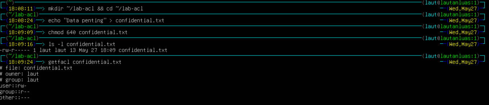

2. Beri akses baca ke satu user tertentu tanpa mengubah owner atau group:
```
setfacl -m u:userA:r confidential.txt
ls -l confidential.txt
getfacl confidential.txt
```
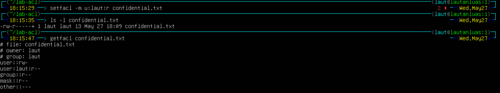

3. Buat direktori bersama yang mewariskan ACL ke file baru:
```
mkdir shared
setfacl -d -m u:userA:rwx shared
setfacl -d -m u:userB:r-x shared
getfacl shared

touch shared/inherited.txt
getfacl shared/inherited.txt
```
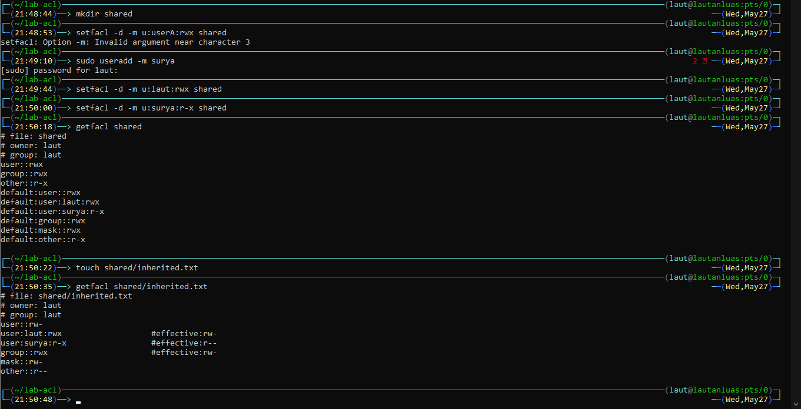

### Pertanyaan Latihan 9.2
1. Mengapa getfacl confidential.txt awalnya tidak menampilkan user tertentu?
2. Setelah setfacl -m u:userA:r confidential.txt, apa perbedaan output ls -ldan getfacl?
3. Mengapa file inherited.txtmewarisi ACL dari direktori shared?

### Jawaban Latihan 9.2
1. File baru tidak punya ACL spesifik. getfacl hanya menampilkan permission standar (owner, group, other).
2. ls -l menampilkan permission dasar dengan tanda + di akhir. getfacl menampilkan detail ACL per user termasuk user:userA:r--.
3. Direktori shared punya default ACL. File baru di dalamnya otomatis mewarisi default ACL tersebut.


## Praktikum 3A - Membuat dan Mengelola User
```
# buat dua user
sudo useradd -m -s /bin/bash userA
sudo useradd -m -s /bin/bash userB
sudo passwd userA
sudo passwd userB

# verifikasi
id userA
getent passwd userA

# modifikasi shell userA
sudo usermod -s /bin/zsh userA
getent passwd userA

# lock dan unlock userB
sudo usermod -L userB
sudo passwd -S userB
sudo usermod -U userB
sudo passwd -S userB
```
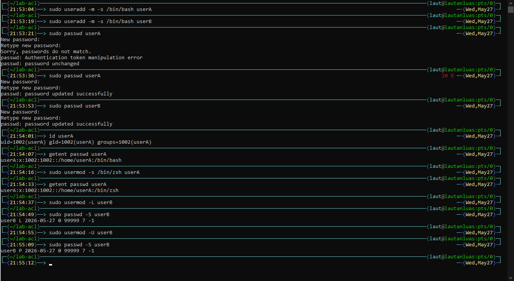

### Pertanyaan Praktikum 3A
1. Apa perbedaan output id userA sebelum dan sesudah menambah group?
2. Bagaimana status passwd -S userB berubah saat akun di-lock?

### Jawaban Praktikum 3A
1. Tidak ada perbedaan untuk id userA
2. Setelah usermod -L, output passwd -S userB menampilkan field L (Locked). Setelah usermod -U, field berubah jadi P (Password active).

## Praktikum 3B - Group Management
```
# buat dua group
sudo groupadd labgroup
sudo groupadd readonly-group

# tambahkan userA ke kedua group
sudo usermod -aG labgroup,readonly-group userA

# tambahkan userB hanya ke readonly-group
sudo usermod -aG readonly-group userB

# verifikasi
id userA
id userB
getent group labgroup
getent group readonly-group
```
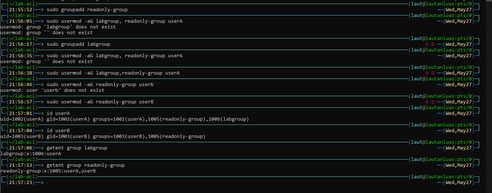

### Pertanyaan Praktikum 3B
1. Apa yang ditampilkan id userAvs groups userA?
2. Mengapa -apada usermod -aGpenting?

### Jawaban Praktikum 3B
1. id userA menampilkan uid, gid, dan semua group. groups userA hanya menampilkan nama group saja.
2. Flag -a mencegah group lama terhapus. Tanpa -a, usermod -G menimpa semua supplementary group.

## Praktikum 3C - Script Backup dengan Opsi
```
# set aging policy untuk userA
sudo chage -M 60 -W 7 -m 1 userA
sudo chage -l userA

# paksa userA ganti password saat login pertama
sudo chage -d 0 userA

# kunci password userB
sudo passwd -l userB
sudo passwd -S userB

# unlock kembali
sudo passwd -u userB
sudo passwd -S userB
```
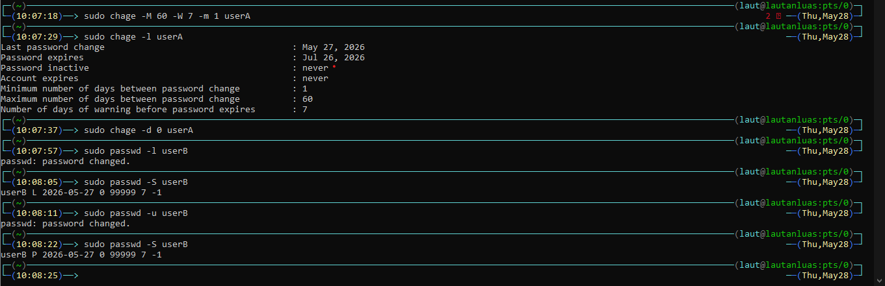

### Pertanyaan Praktikum 3C
1. Apa arti nilai yang ditampilkan chage -l userA?
2. Bagaimana cara membuktikan userB terkunci dari output passwd -S?
3. Kapan sebaiknya menggunakan chage -d 0vs passwd -e?

### Jawaban Praktikum 3C
1. chage -l userA menampilkan: password expired date, last change, minimum 1 hari ganti password, maximum 60 hari, warning 7 hari sebelum expired.
2. Field ke-2 output passwd -S userB menunjukkan L, artinya password terkunci.
3. chage -d 0 memaksa ganti password di login berikutnya. passwd -e efeknya sama, tapi lebih portabel antar distro.


## Praktikum 4: Konfigurasi sudo
1. Buat file konfigurasi sudo khusus untuk userA.
```
sudo visudo -f /etc/sudoers.d/lab-userA
```

Perintah ini membuka editor aman khusus untuk file sudoers baru. Jika sintaks salah, visudo akan memperingatkan sebelum file disimpan.
Isi file dengan aturan berikut:
```
userA ALL=(root) NOPASSWD: /usr/bin/apt update, /usr/bin/apt upgrade
userA ALL=(root) /bin/systemctl status *
```
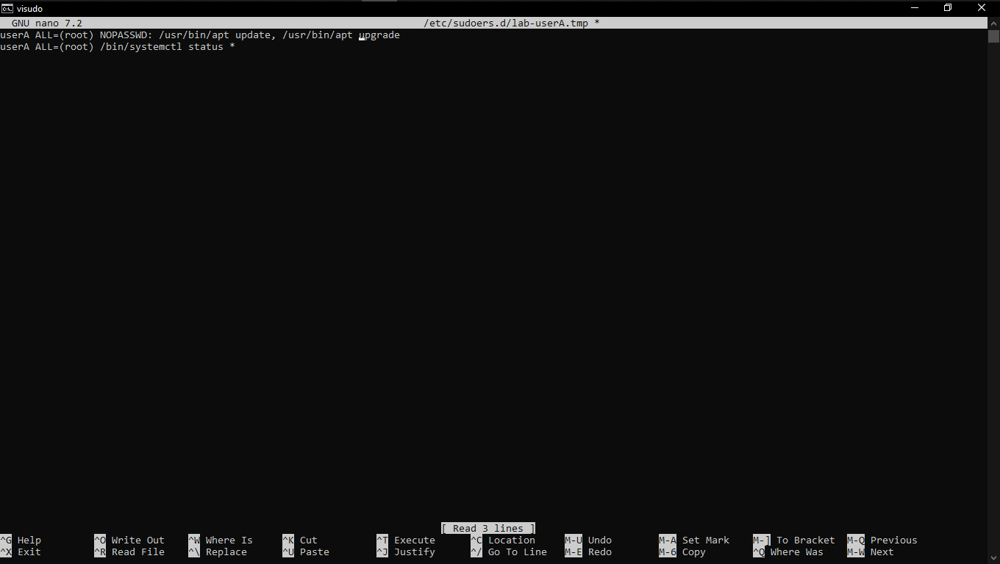

2. Verifikasi aturan yang aktif dan uji hasilnya:
```
sudo -l -U userA
sudo grep "userA" /var/log/auth.log | tail -10
```
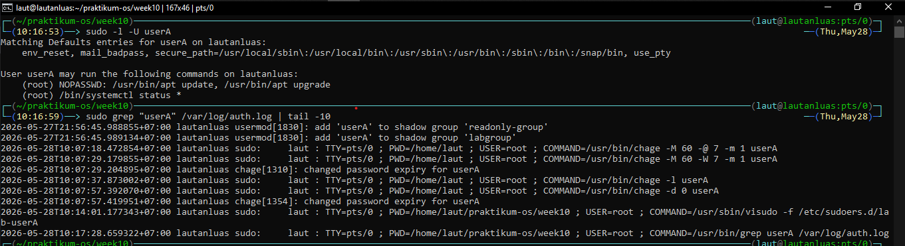

### Pertanyaan Analisis 
1. Mengapa aturan disimpan di /etc/sudoers.d//, bukan langsung di /etc/sudoers?
2. Mana perintah yang bisa dijalankan tanpa password, dan mana yang masih perlu autentikasi?
3. Informasi apa saja yang dicatat di log sudo?

### Jawaban Analisis
1. File di /etc/sudoers.d/ modular dan aman. Edit /etc/sudoers langsung berisiko merusak seluruh konfigurasi sudo.
2. Tanpa password: /usr/bin/apt update dan /usr/bin/apt upgrade. Perlu autentikasi: /bin/systemctl status *.
3. Log mencatat: timestamp, hostname, user yang menjalankan, TTY, working directory, target user, dan perintah lengkap.


## Praktikum 5: Disk Quota
1. Buat image filesystem kecil dan mount dengan opsi quota.
```
sudo dd if=/dev/zero of=/tmp/quota-test.img bs=1M count=100
sudo mkfs.ext4 /tmp/quota-test.img
sudo mkdir -p /mnt/quota-test
sudo mount -o loop,usrquota,grpquota /tmp/quota-test.img /mnt/quota-test
```
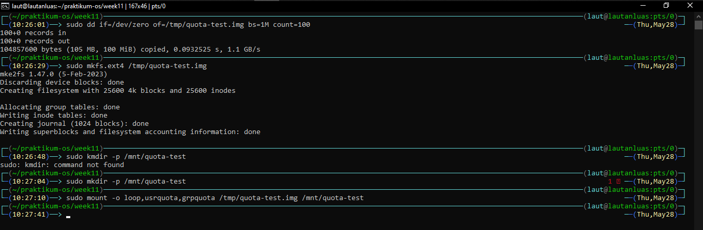

2. Buat database quota dan aktifkan enforcement.
```
sudo quotacheck -cug /mnt/quota-test
sudo quotaon -v /mnt/quota-test
sudo repquota /mnt/quota-test
```
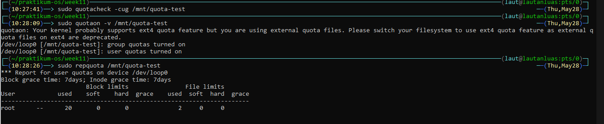

3. Tetapkan quota untuk user uji dan amati hasilnya.
```
sudo edquota -u userA
# contoh: soft block 5120, hard block 10240
sudo repquota /mnt/quota-test
```
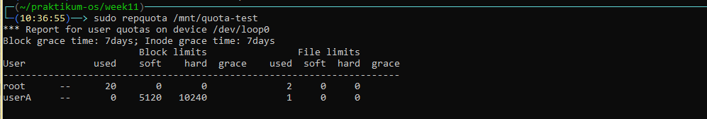

4.  Bersihkan lingkungan uji setelah selesai.
```
sudo quotaoff /mnt/quota-test
sudo umount /mnt/quota-test
sudo rm /tmp/quota-test.img
```
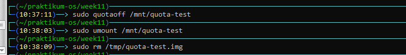

### Pertanyaan Analisis 
1. Apa perbedaan soft limit dan hard limit saat quota mulai terlampaui?
2. Mengapa praktikum ini memakai loopback filesystem, bukan langsung /home/?
3. Dari output repquota, informasi apa yang menunjukkan quota sudah aktif?

### Jawaban Analisis
1. Soft limit memberi grace period 7 hari sebelum diblokir. Hard limit langsung memblokir tanpa toleransi.
2. Loopback aman untuk praktikum, tidak merusak /home asli jika ada kesalahan konfigurasi.
3. Kolom soft dan hard menunjukkan nilai limit aktif. Jika masih 0, quota belum aktif.


## Latihan
- Latihan 9.A — Audit dan Kolaborasi
1. Temukan file SUID aktif dengan find / -perm -4000 -type f 2>/dev/null, lalu jelaskan
tiga file yang Anda kenali beserta alasannya.
2. Cari direktori world-writable dan tentukan mana yang valid dan mana yang berisiko.
3. Rancang konfigurasi permission standar dan ACL untuk direktori proyek /srv/webapp/ agar group webapp-team dapat menulis, user deploy hanya membaca, dan file baru selalu mewarisi group proyek.
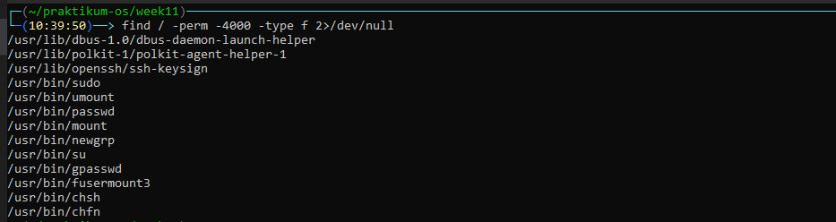
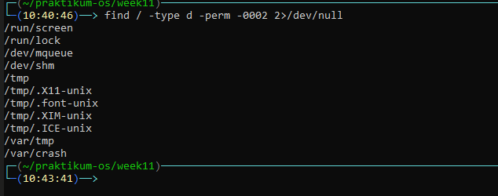

- Jawaban
1. Tiga file SUID dari sistem:
    - /usr/bin/sudo — menjalankan perintah sebagai root dengan otorisasi.
    - /usr/bin/passwd — mengubah password meski /etc/shadow milik root.
    - /usr/bin/su — switch user membutuhkan akses file shadow.
2. - Valid (by design):
    - /tmp dan /var/tmp — direktori temporary, memang world-writable.
    - /dev/shm, /dev/mqueue — shared memory, wajar world-writable.
    - /tmp/.X11-unix, /tmp/.font-unix, dll — socket runtime, normal.
   
   - Perlu diwaspadai:
    - /run/screen — berisiko jika ada user tidak terpercaya di sistem.
    - /var/crash — seharusnya tidak world-writable, cek permission-nya:
3. 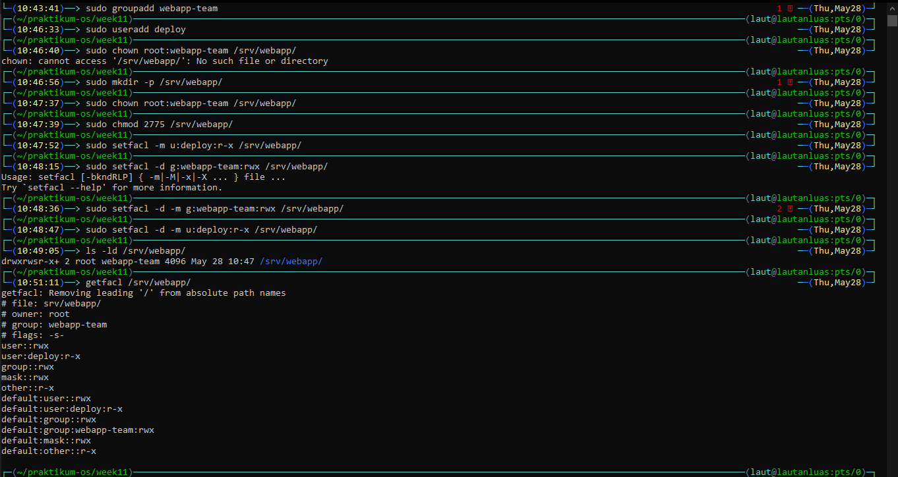


- Latihan 9.B — Kebijakan Akun dan Quota
Tuliskan langkah untuk membuat user intern, menambahkannya ke group labgroup, memaksa pergantian password tiap 45 hari (warning 7 hari), memberi izin sudo hanya untuk systemctl status, dan menetapkan quota ruang serta inode sederhana pada /home/.

- Jawaban
1. Buat user dan tambah ke group:
```
sudo useradd -m -s /bin/bash intern
sudo passwd intern
sudo usermod -aG labgroup intern
```
2. Set password aging:
```
sudo chage -M 45 -W 7 intern
```

3. Sudo khusus systemctl status:
```
sudo visudo -f /etc/sudoers.d/lab-intern
```
isinya: 
```
intern ALL=(root) NOPASSWD: /bin/systemctl status *
```
4. Setup loopback untuk quota:
```
sudo dd if=/dev/zero of=/quota-intern.img bs=1M count=100
sudo mkfs.ext4 /quota-intern.img
sudo mkdir -p /mnt/quota-intern
sudo mount -o loop,usrquota /quota-intern.img /mnt/quota-intern
sudo quotacheck -cug /mnt/quota-intern
sudo quotaon -v /mnt/quota-intern
```
5. Set quota:
```
sudo edquota -u intern
```
Isi soft 5120, hard 10240, inode soft 100, hard 150.