# Laporan Praktikum Sistem Operasi Jobsheet 12

<h4>Nama : Surya Sadikin Firdaus<h4>
<h4>NIM : 254107020105<h4>
<h4>Kelas : TI-1H<h4>

## Praktikum 1 -  Amati Layaan Aktif Saat Boot
1. Lihat semua layanan yang sedang berjalan.
```
systemctl list-units --type=service --state=running
# catat berapa banyak layanan yang aktif
```
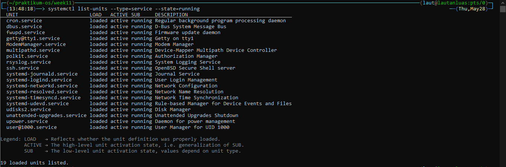

2. Lihat semua unit service yang ada (aktif maupun tidak).
```
systemctl list-unit-files --type=service | head -30
# enabled = akan start otomatis saat boot
# disabled = tidak start otomatis, bisa dijalankan manual
# static = tidak bisa di-enable/disable, hanya dipanggil oleh layanan lain
```
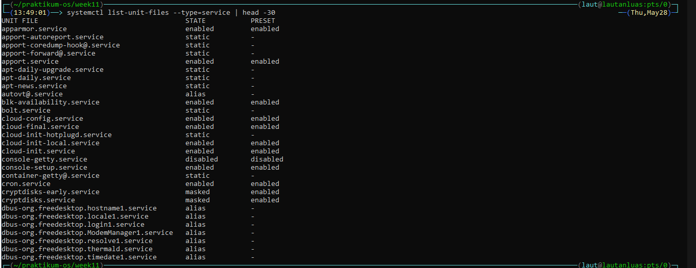

3. Analisis waktu boot dan temukan layanan paling lambat.
```
systemd-analyze
systemd-analyze blame | head -15
```
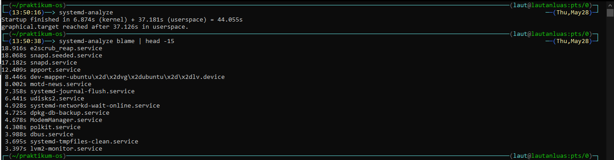


## Praktikum 2 - Kelola Layanan SSH
1. Periksa status SSH secara menyeluruh:
```
systemctl status ssh
systemctl is-active ssh
systemctl is-enabled ssh
```
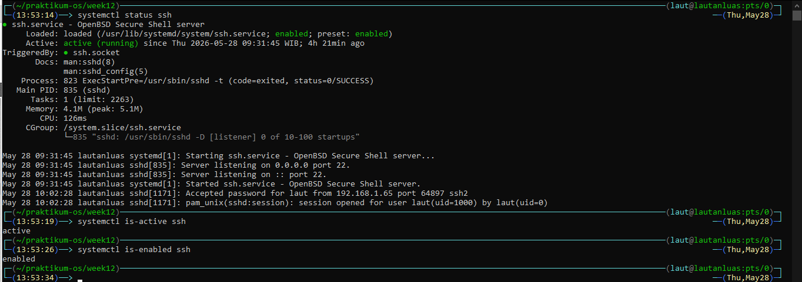

2. Lakukan restart dan pantau perubahannya:
```
sudo systemctl restart ssh
systemctl status ssh
# perhatikan: Loaded, Active, dan Main PID bisa berubah setelah restart
```
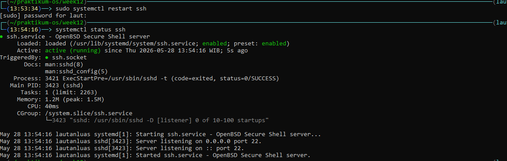

3. Lihat dependensi SSH:
```
systemctl list-dependencies ssh
# layanan lain yang harus aktif sebelum SSH bisa berjalan
```
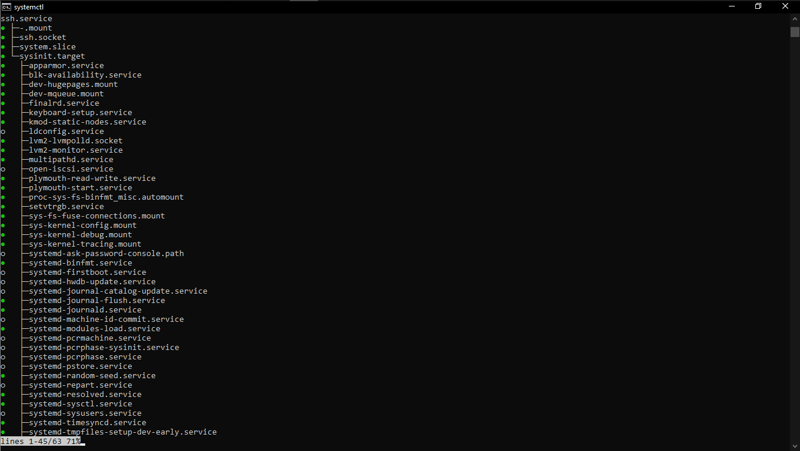

4. Cek semua unit yang gagal di sistem:
```
systemctl --failed
# jika ada, ini adalah daftar layanan yang butuh perhatian
```
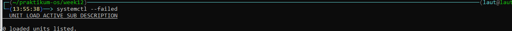


## Praktikum 3 - Membuat dan Mengelola User
1.  Siapkan konten yang akan dilayani.
```
cd ~/lab-os/chapter10-services
mkdir -p situs-demo
nano situs-demo/index.html
# Tulis isi berkas berikut
<!DOCTYPE html>
<html>
<body>
<h1>Halo dari layanan systemd kustom!</h1>
<p>Layanan ini dibuat pada praktek Bab 10.</p>
</body>
</html>
```
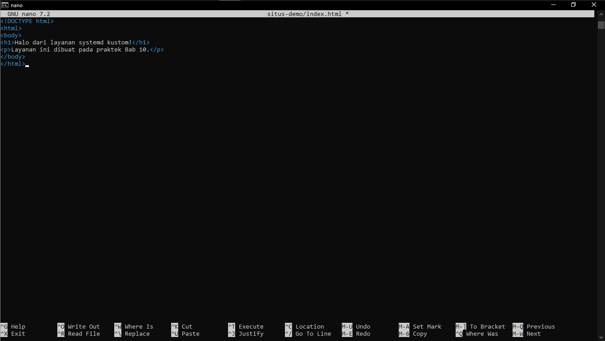

2. Buat skrip wrapper untuk server HTTP. 
```
nano ~/lab-os/chapter10-services/jalankan-server.sh
# Tulis isi berkas berikut
#!/bin/bash
DIREKTORI="$HOME/lab-os/chapter10-services/situs-demo"
PORT=9090
echo "Memulai server di port $PORT..."
exec python3 -m http.server $PORT --directory "$DIREKTORI"
chmod +x ~/lab-os/chapter10-services/jalankan-server.sh
```
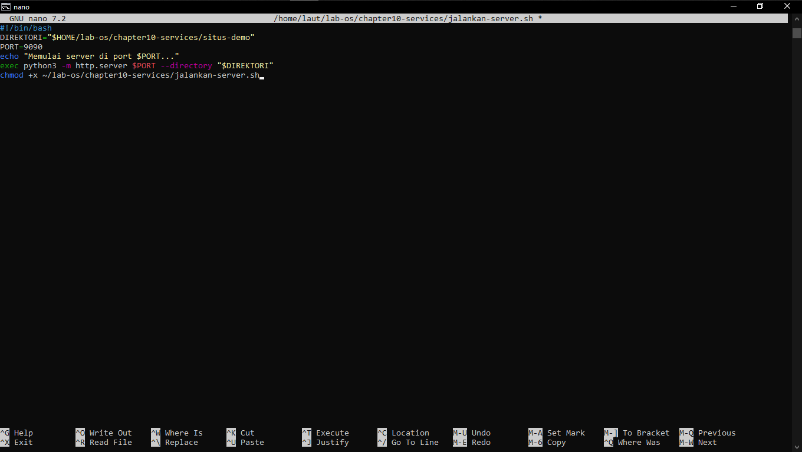

3. Buat berkas unit systemd untuk layanan ini.
```
nano ~/lab-os/chapter10-services/demo-web.service
# Tulis isi berkas berikut
[Unit]
Description=Demo Web Server Praktek Bab 10
After=network.target

[Service]
Type=simple
User=nama-pengguna-kamu
WorkingDirectory=/home/nama-pengguna-kamu/lab-os/chapter10-services/
situs-demo
ExecStart=/usr/bin/python3 -m http.server 9090
Restart=on-failure
RestartSec=3s

[Install]
WantedBy=multi-user.target

# salin ke lokasi unit systemd
sudo cp ~/lab-os/chapter10-services/demo-web.service /etc/systemd/
system/demo-web.service
# minta systemd membaca ulang berkas unit yang baru dibuat
sudo systemctl daemon-reload
```
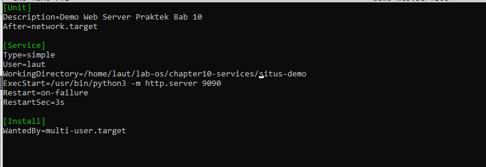

4. Jalankan layanan dan verifikasi.
```
sudo systemctl start demo-web
systemctl status demo-web
# coba akses layanan
curl http://localhost:9090
```
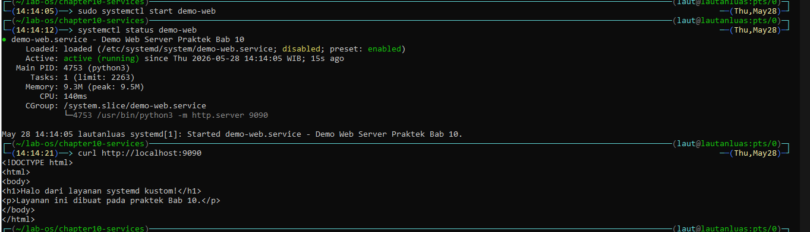

5. Uji fitur restart otomatis.
```
# lihat PID proses saat ini
systemctl status demo-web | grep "Main PID"

# hentikan proses secara paksa (simulasi crash)
sudo kill -9 $(systemctl show demo-web --property=MainPID --value)

# tunggu beberapa detik lalu cek -- systemd harus menghidupkannya
kembali
sleep 5
systemctl status demo-web
# PID akan berubah karena proses baru dijalankan
```
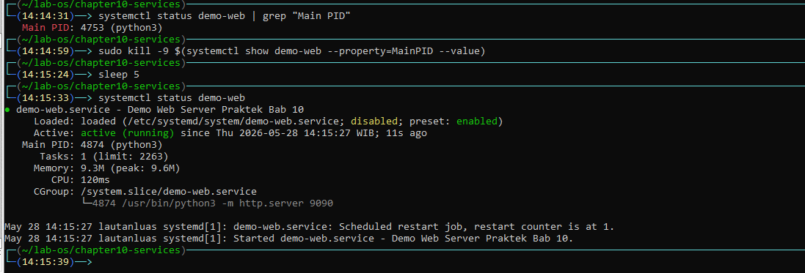

6. Bersihkan layanan uji setelah selesai.
```
sudo systemctl disable --now demo-web
sudo rm /etc/systemd/system/demo-web.service
sudo systemctl daemon-reload
```
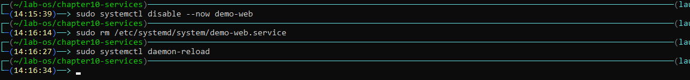


## Praktikum 4 - Filter dan Analisis Log Layanan
1. Lihat log SSH dari satu jam terakhir.
```
journalctl -u ssh --since "1 hour ago" --no-pager
# jika tidak ada log SSH, gunakan layanan lain yang aktif
journalctl -u cron --since "1 hour ago" --no-pager
```
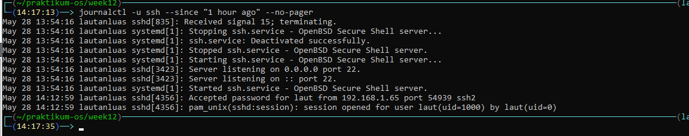

2. Filter log berprioritas error ke atas
```
journalctl -b -p err --no-pager
# ini menampilkan semua error dan yang lebih serius sejak boot
```
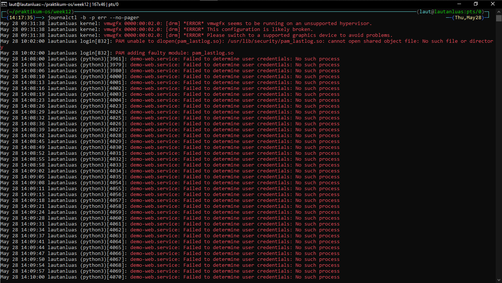

3. Ikuti log secara real-time sambil memicu aktivitas.
```
# jalankan di terminal pertama:
journalctl -u ssh -f

# di terminal kedua, coba login SSH ke localhost
# ssh localhost
# lalu lihat apa yang muncul di terminal pertama
```
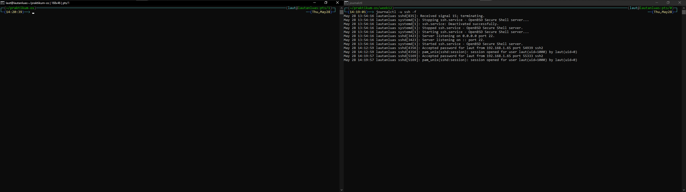

4. Ekstrak log ke berkas untuk analisis.
```
cd ~/lab-os/chapter10-services

# simpan semua log layanan ssh dari hari ini ke berkas
journalctl -u ssh --since today --no-pager > log-ssh-hari-ini.txt

# hitung jumlah baris log
wc -l log-ssh-hari-ini.txt

# jika ada, cari baris yang mengandung kata "error" atau "failed"
grep -i "error\|failed" log-ssh-hari-ini.txt | head -20
```
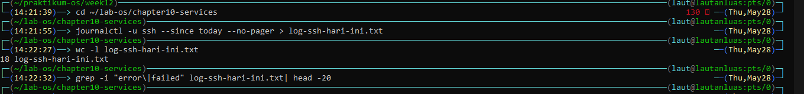


## Praktikum 5 - Konfigurasi SSH Server
1. Periksa konfigurasi SSH saat ini.
```
sudo grep -n "^Port\|^#Port" /etc/ssh/sshd_config
ss -tlnp | grep ssh
```
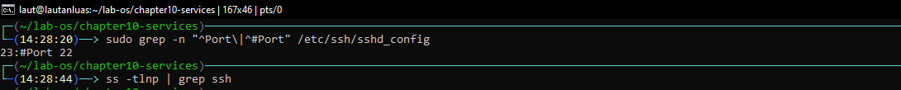

2. Buat backup dan ubah port SSH
```
sudo cp /etc/ssh/sshd_config /etc/ssh/sshd_config.backup.lab12

# ubah port dari 22 ke 2222 (atau port lain yang belum dipakai)
sudo sed -i 's/^#Port 22/Port 2222/' /etc/ssh/sshd_config
# jika baris Port 22 tidak dikomentari:
# sudo sed -i 's/^Port 22/Port 2222/' /etc/ssh/sshd_config

# verifikasi perubahan
grep "^Port" /etc/ssh/sshd_config
```
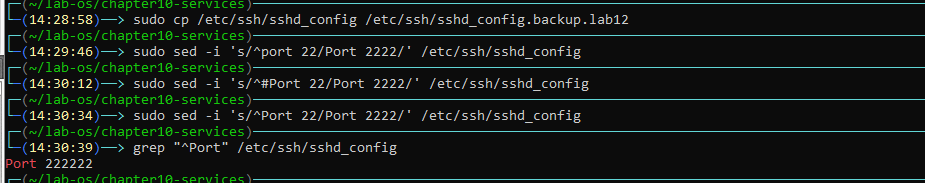

3.  Validasi konfigurasi dan restart layanan.
```
# WAJIB: validasi sintaks sebelum restart
sudo sshd -t
echo "Kode keluar sshd -t: $?"
# kode 0 berarti sintaks valid

# restart layanan
sudo systemctl restart ssh
systemctl status ssh
```
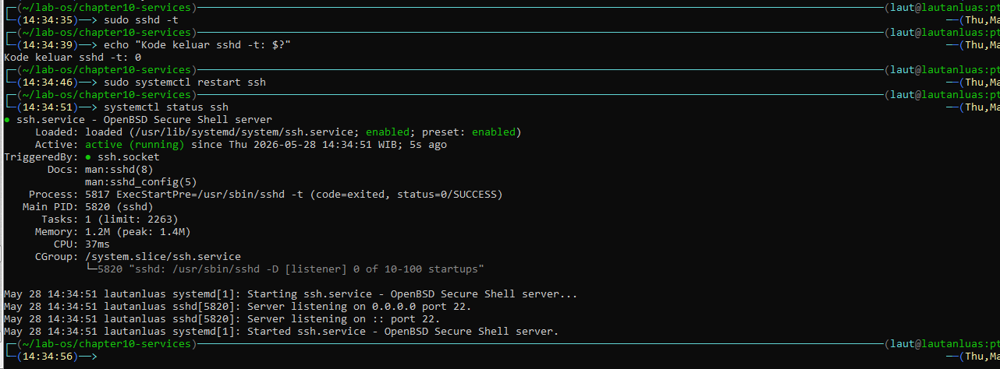

4. Verifikasi port baru dengan ss.
```
ss -tlnp | grep ssh
# seharusnya menampilkan port 2222, bukan 22

# simpan hasil ke berkas bukti
ss -tlnp | grep ssh > ~/lab-os/chapter10-services/bukti-port-ssh.txt
cat ~/lab-os/chapter10-services/bukti-port-ssh.txt
```
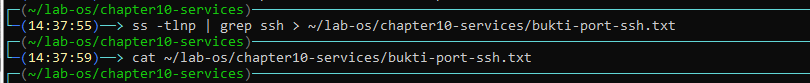

5. Kembalikan port SSH ke 22 setelah praktek.
```
sudo cp /etc/ssh/sshd_config.backup.lab12 /etc/ssh/sshd_config
sudo sshd -t
sudo systemctl restart ssh
ss -tlnp | grep ssh
# harus kembali ke port 22
```


## Latihan
### Latihan 10.1 Audit Layanan dan Analisis Boot
Lakukan audit menyeluruh terhadap layanan yang berjalan di sistem.
1. Jalankan systemctl list-units –type=service –state=running dan catat semua layanan aktif. Pilih tiga layanan yang kamu kenal, periksa status masing-masing dengan systemctl status, dan jelaskan fungsinya.
2. Jalankan systemd-analyze blame dan identifikasi lima layanan dengan waktu inisialisasi terlama. Tampilkan hasilnya menggunakan pipeline: systemd-analyze blame | head -5.
3. Jalankan systemctl –faileddan dokumentasikan hasilnya. Jika ada layanan yang gagal, cari tahu penyebabnya dengan journalctl -u nama-layanan -n 30.
### Jawaban 10.1
1. Tiga layanan aktif:
    - ssh.service — menerima koneksi remote via SSH.
    - cron.service — menjalankan scheduled task otomatis.
    - rsyslog.service — mencatat system log ke file.
2. Lima layanan terlama boot:
    - fwupd-refresh.service — 19.574s
    - e2scrub_reap.service — 18.916s
    - snapd.seeded.service — 18.068s
    - snapd.service — 17.182s
    - apport.service — 12.409s
3. systemctl --failed — tidak ada layanan gagal. Sistem berjalan normal.

### Latihan 10.2 Layanan Kustom dengan Restart Otomatis
Buat layanan systemd kustom yang mendemonstrasikan fitur restart otomatis.
1. Buat skrip Bash (referensi Bab 7) bernama monitor-disk.shyang setiap 30 detik menuliskan penggunaan disk ke berkas log. Gunakan df -hdan date.
2. Buat berkas unit /etc/systemd/system/monitor-disk.serviceuntuk menjalankan skrip tersebut dengan konfigurasi: Restart=always, RestartSec=5s, dan berjalan sebagai pengguna kamu sendiri.
3. Aktifkan dan jalankan layanan. Verifikasi dengan systemctl statusdan pastikan log masuk ke journal.
4. Simulasikan crash dengan membunuh proses secara paksa (kill -9), tunggu 10 detik, dan verifikasi bahwa layanan hidup kembali secara otomatis.
5. Bersihkan: nonaktifkan layanan dan hapus berkas unit setelah selesai.
### Jawaban 10.2
isi script bash:
```
#!/bin/bash
while true; do
    echo "=== $(date) ===" >> ~/disk-monitor.log
    df -h >> ~/disk-monitor.log
    sleep 30
done
```

isi services:
```[Unit]
Description=Monitor Disk Usage

[Service]
Type=simple
User=laut
ExecStart=/home/laut/monitor-disk.sh
Restart=always
RestartSec=5s

[Install]
WantedBy=multi-user.target
```
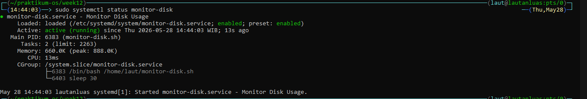


### Latihan 10.3 Investigasi Log dan Keamaan SSH
Analisis log sistem dan tingkatkan keamanan konfigurasi SSH.
1. Gunakan journalctl -b -p err untuk menemukan semua error sejak boot terakhir. Simpan hasilnya ke berkas dan hitung jumlah baris dengan wc -l.
2. Lakukan tiga perubahan keamanan pada /etc/ssh/sshd_config: tambahkan PermitRootLogin no, MaxAuthTries 3, dan LoginGraceTime 30. Ikuti alur aman: backup, edit, validasi sshd -t, reload.
3. Setelah reload, verifikasi tiga hal: layanan masih berjalan (systemctl status ssh), port masih mendengarkan (ss -tlnp | grep ssh), dan konfigurasi baru terbaca (grep -E "PermitRoot|MaxAuth|GraceTime" /etc/ssh/sshd_config).
4. Kembalikan konfigurasi SSH ke kondisi semula menggunakan berkas backup.
### Jawaban 10.1
1. 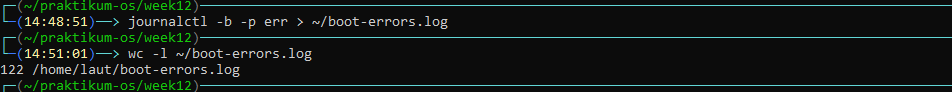
2. 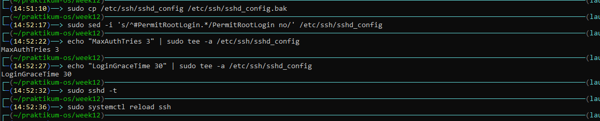
3. 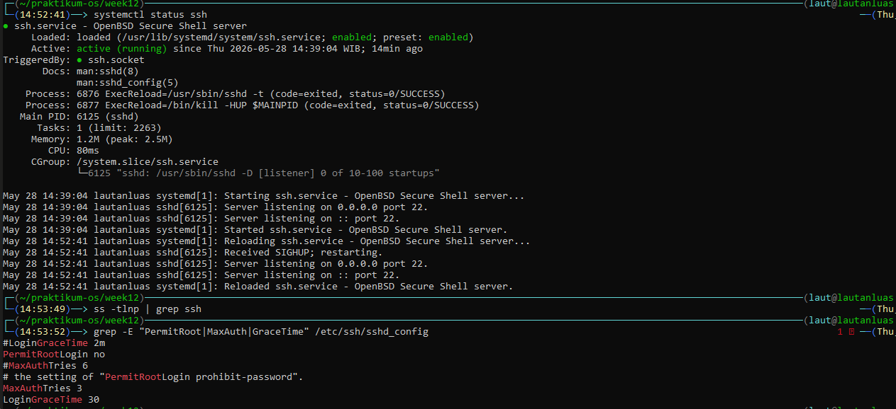
3. 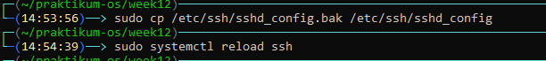