# Laporan Praktikum Sistem Operasi Jobsheet 3

<h4>Nama : Surya Sadikin Firdaus<h4>
<h4>NIM : 254107020105<h4>
<h4>Kelas : TI-1H<h4>

## 1.1 Latihan
### Pertanyaan Latihan 3.1
Buatlah script yang:
1. Menampilkan daftar 10 file terbesar di direktori /var/log/
2. Menyimpan hasilnya ke file large-logs.txt
3. Menampilkan output juga di terminal menggunakan tee
4. Menangani error dengan redirect ke error.log

### Jawaban Latihan 3.1
* Script yang dibuat
```
#!/bin/bash
echo "=== 10 File Terbesar di /var/log/ ==="

du -sh /var/log/* 2> error.log | sort -rh | head -10 | tee large-logs.txt

echo "=== Selesai ==="
echo "Hasil disimpan di: large-logs.txt"
echo "Error (jika ada) disimpan di: error.log"
```


* Hasil di terminal
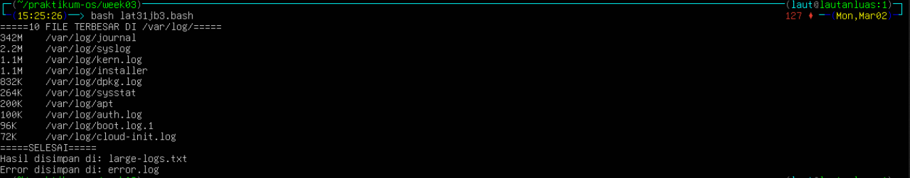

* Isi file large-logs.txt
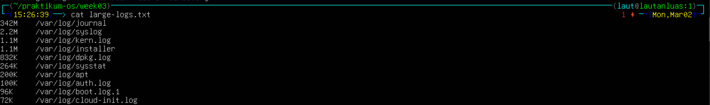

* Isi file error.log
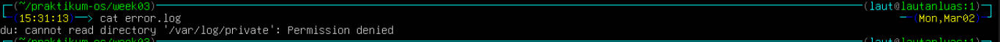


### Pertanyaan Latihan 3.2
Buat pipeline yang:
1. Membaca /etc/passwd
2. Mengekstrak username (kolom pertama)
3. Mengurutkan alfabetis
4. Menyimpan ke file sorted-users.txt
Hint: Gunakan cut, sort, dan operator redirect.

### Jawaban Latihan 3.2
* Pipeline yang dibuat
```
cat /etc/passwd | cut -d: -f1 | sort > sorted-users.txt
```
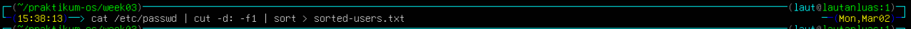

* Hasil
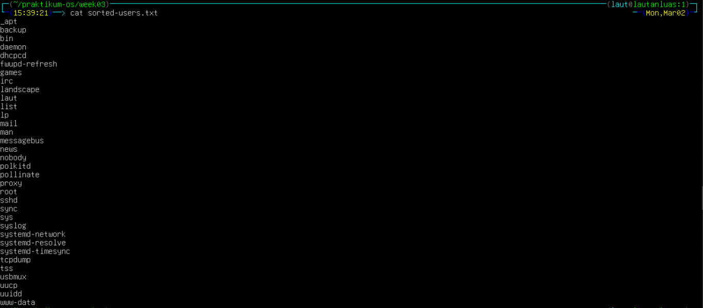

### Pertanyaan Latihan 3.3
Tulis script monitoring yang:
1. Mencatat penggunaan CPU dan memory setiap 5 detik
2. Menyimpan log dengan timestamp
3. Berjalan selama 1 menit (12 iterasi)
4. Output ditampilkan di terminal DAN disimpan ke file

### Jawaban Latihan 3.3
* Script
```
#!/bin/bash
LOGFILE="/home/laut/praktikum-os/week03/monitor.log"

for i in $(seq 1 12); do
    echo "=== $(date) ===" | tee -a "$LOGFILE"
    top -bn1 | grep "Cpu(s)" | tee -a "$LOGFILE"
    free -h | tee -a "$LOGFILE"
    sleep 5
done
```
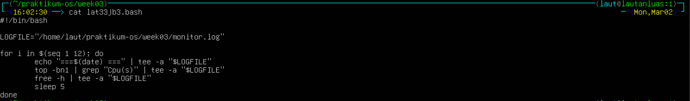

* Hasil terminal
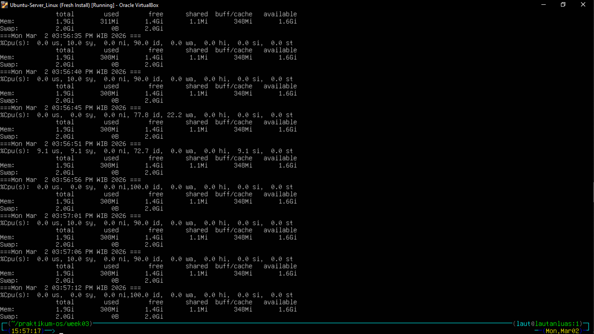

* Hasil di file monitor.log
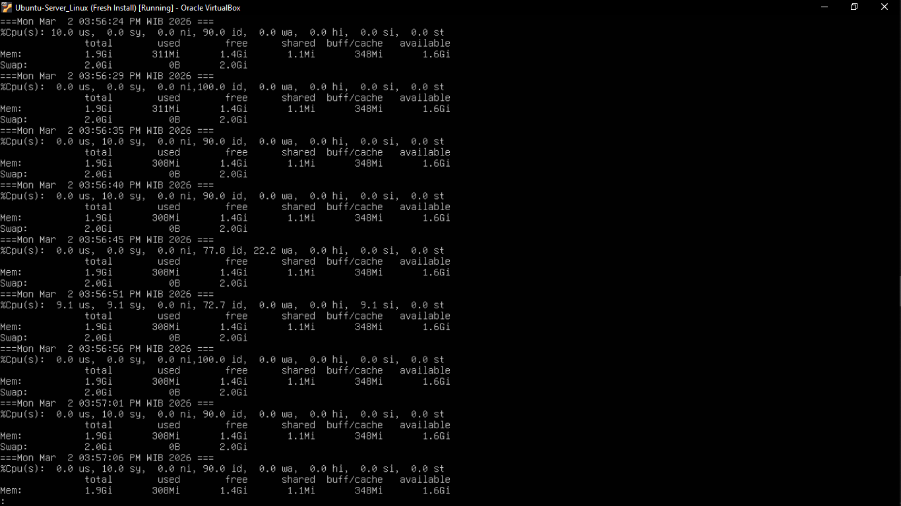


### Pertanyaan Latihan 3.4
Buat perintah yang:
1. Mencari semua file .conf di sistem
2. Membuang pesan "Permission denied"
3. Menghitung jumlah file yang ditemukan
4. Menyimpan daftar path lengkap ke file

### Jawaban Latihan 3.4
* Pipeline
```
find / -name "*.conf" 2>/dev/null | tee conf-files.txt | wc -l
```


* Hasil di file
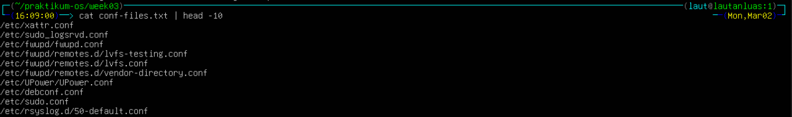
Sebenarnya terdapat 400 lebih hasil yang tersimpan di dalam file, saya memilih 1- teratas agar bisa terlihat baik saat didokumentasikan
    - Bukti
    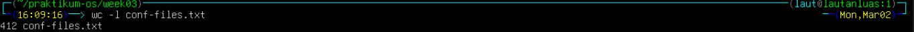


### Pertanyaan Latihan 3.5
Implementasikan script backup yang:
1. Menggunakan tar untuk backup direktori
2. Menampilkan progress dengan tee
3. Mencatat stdout ke backup-success.log
4. Mencatat stderr ke backup-error.log
5. Menambahkan timestamp di setiap log entry

### Jawaban Latihan 3.5
* Script
```
#!/bin/bash

TIMESTAMP="$(date '+%Y-%m-%d %H:%M:%S')"

echo "[$TIMESTAMP] Backup dimulai" | tee -a backup-success.log

tar -czvf backup.tar.gz $HOME 2>> backup-error.log | tee -a backup-success.log

echo "[$TIMESTAMP] Backup selesai" | tee -a backup-success.log
```
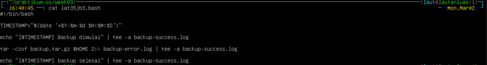


* Progress
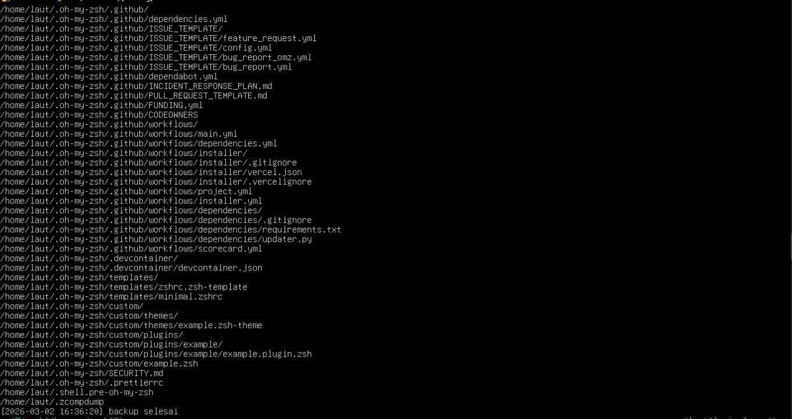

* Isi file backup-success.log


* Isi file backup-error.log
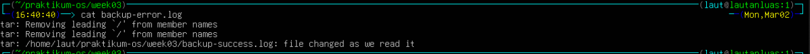


