# Laporan Praktikum Sistem Operasi Jobsheet 6

<h4>Nama : Surya Sadikin Firdaus<h4>
<h4>NIM : 254107020105<h4>
<h4>Kelas : TI-1H<h4>

## Tugas Praktikum 1 -  Toolkit Bash Administrator Pribadi
* Konteks riil: Seorang administrator serig mengulang perintah yang sama setiap hari. Agar pekerjaan lebih efisien dan konsisten, ia perlu memiliki toolkit Bash pribadi yang otomatis aktif setiap login.

* Intruksi Tugas:
1. Tambahkan konfigurasi pada .bashrc untuk:
    - Menambahkan direktori bin pribadi ke PATH
    - membuat minimal 2 alias yang membantu kerja harian
    - Membuat minimal 1 fungsi shell yang berguna untuk administrasi
2. Pastikan konfigurasi tersebut aktif kembali saat membuka shell login
3. Buat satu script sederhana di direktori bin pribadi, misalnya script untuk menampilkan ringkasan sistem
4. Uji dari direktori yang berbeda untuk memastikan script dapat dipanggil tanpa menuliskan path lengkap
5. Simpan bukti pengujian ke file toolkit-bash-report.txt

* Minimal luaran:
- isi blok konfigurasi yang ditambahkan ke .bashrc
- output echo $PATH
- output type untuk alias, fungsi, dan script
- file laporan toolkit-bash-report.txt

## Jawaban Praktikum 1
1. Isi blok konfigurasi:
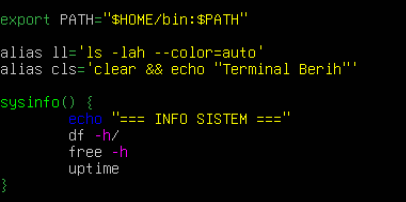
2. Output $PATH:

3. Output type untuk alias, fungsi, dan script
    * output alias:
    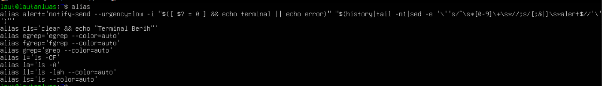
    * output sysinfo:
    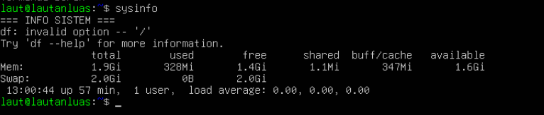
    * output syssum.sh:
    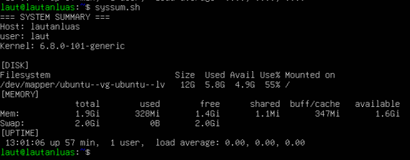

4. file laporan toolkit-bash-report.txt
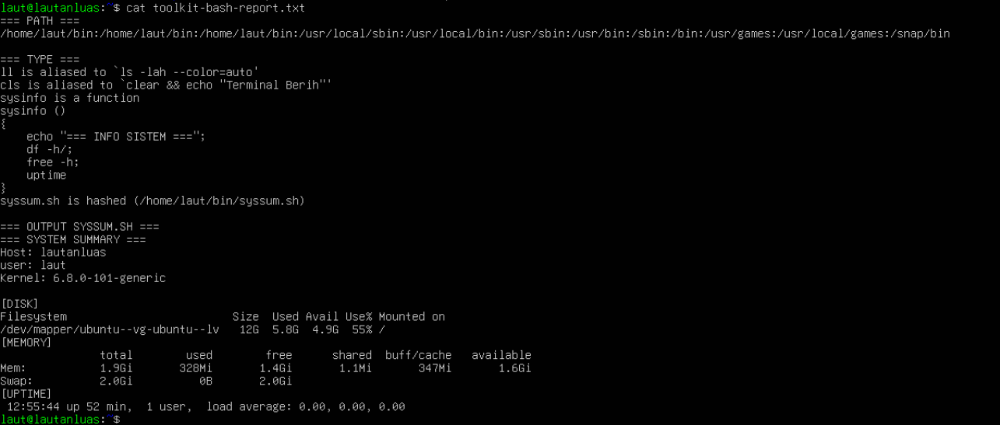

## Tugas Praktikum 2 - Audit File Konfigurasi dan Logging Aman
* Konteks riil: saat troubleshooting, administrator sering perlu menginventarisasi file konfigurasi dan memisahkan output normal dari pesan error.

* Instruksi tugas:
1. Buat file laporan bernama audit-konfigurasi-$(date +%F).txt.
2. Cari file *.conf di dalam /etc dan simpan hasilnya ke file laporan.
3. Catat jumlah total file konfigurasi yang ditemukan.
4. Jika ada pesan error, simpan ke file terpisah, misalnya audit-error.log.
5. Tampilkan isi laporan ke terminal dan sekaligus simpan menggunakan tee.
6. Tambahkan ringkasan singkat 3–5 baris yang menjelaskan mengapa pemisahan stdout dan stderr penting dalam audit sistem.

* Syarat konsep yang harus muncul:
- redirection >, 2>, atau &>,
- pipeline,
- tee,
- penggunaan variabel atau command substitution.

* Minimal luaran:
- file laporan audit,
- file log error,
- perintah yang digunakan,
- analisis singkat hasil audit.

## Jawaban Praktikum 2
* File laporan audit:
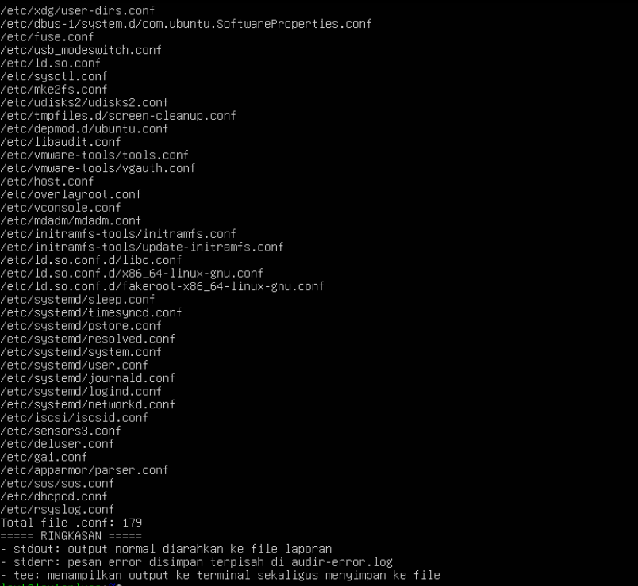
* File log error:
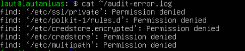
* perintah yang digunakan:
```
find /etc -name "*.conf"     : mencari file .conf di /etc
2>/dev/null atau 2>file      : redirect stderr ke file terpisah
> file                       : redirect stdout ke file laporan
| tee -a file                : tampilkan output + simpan ke file
wc -l                        : hitung jumlah baris/file
cat                          : tampilkan isi file
date +%F                     : ambil tanggal untuk nama file
```
* Analisis singkat audit
- Ditemukan 1799 file konfigurasi .conf di /etc
- Beberapa file tidak dapat diakses (permission denied) → tersimpan di audit-error.log
- File konfigurasi mencakup layanan: network, audio, sistem, package manager
- Error pada stderr dipisah agar laporan utama tetap bersih

## Tugas Praktikum 3 - Mini Health Check Harian Server
* Konteks riil: administrator perlu membuat pemeriksaan cepat (health check) untuk
mengetahui kondisi dasar server sebelum dan sesudah maintenance.

* Instruksi tugas:
1. Buat script Bash bernama daily-healthcheck pada direktori bin pribadi.
2. Script minimal harus menampilkan:
    - tanggal dan waktu,
    - hostname,
    - user aktif,
    - shell aktif,
    - uptime,
    - penggunaan memori,
    - penggunaan filesystem root,
    - 10 baris terakhir history command yang relevan dengan pengecekan.
3. Simpan hasil ke file log harian, misalnya healthcheck-$(date +%F).log.
4. Tampilkan hasil ke terminal dan ke file secara bersamaan.
5. Jika Anda menggunakan pipeline dengan tee, cek juga status exit command utama

* Syarat konsep yang harus muncul:
    - environment variable,
    - PATH,
    - alias atau fungsi pendukung,
    - history,
    - tee,
    - penanganan error dasar.

* Minimal luaran:
    - file script yang executable,
    - contoh isi file log hasil eksekusi,
    - penjelasan singkat fungsi tiap bagian script.

## Jawaban Praktikum 3
* File script:
```
#!/bin/bash

LOGFILE="$HOME/healthcheck-$(date +%F).log"

{
  echo "==============================="
  echo "  DAILY HEALTH CHECK"
  echo "==============================="
  echo ""
  echo "[TANGGAL/WAKTU]"
  date

  echo ""
  echo "[HOSTNAME]"
  hostname

  echo ""
  echo "[USER AKTIF]"
  who

  echo ""
  echo "[SHELL AKTIF]"
  echo $SHELL

  echo ""
  echo "[UPTIME]"
  uptime

  echo ""
  echo "[MEMORI]"
  free -h

  echo ""
  echo "[FILESYSTEM ROOT]"
  df -h /

  echo ""
  echo "[10 HISTORY TERAKHIR]"
  tail -10 ~/.bash_history

  echo ""
  echo "==============================="
  echo "  SELESAI: $(date)"
  echo "==============================="

} | tee "$LOGFILE"

# Penanganan error
if [ $? -eq 0 ]; then
  echo "" 
  echo "Log tersimpan: $LOGFILE"
else
  echo "ERROR: Gagal menyimpan log." >&2
fi
```
* Isi file log hasil eksekusi:
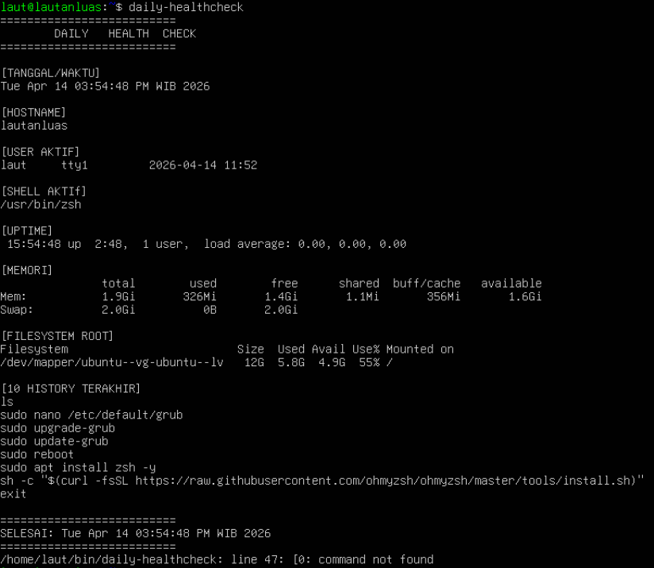

* Penjelasan singkat tiap fugsi:
```
=============================== 
Garis pembatas tampilan laporan.

date
Menampilkan tanggal dan waktu saat skrip dijalankan.

hostname
Menampilkan nama komputer/mesin.

who
Menampilkan user yang sedang login.

echo $SHELL
Menampilkan shell yang sedang digunakan (bash/sh/dll).

uptime
Menampilkan lama sistem berjalan sejak booting.

free -h
Menampilkan penggunaan RAM dan swap.

df -h /
Menampilkan penggunaan storage pada partisi root.

tail -10 ~/.bash_history
Menampilkan 10 perintah terakhir yang dijalankan user.

tee "$LOGFILE"
Menampilkan output ke terminal sekaligus menyimpan ke file log.

if [ $? -eq 0 ]
Mengecek apakah perintah sebelumnya berhasil (exit status 0 = sukses).

>&2
Mengarahkan pesan error ke stderr, bukan stdout.
```


## Tugas Praktikum 4 - Penanganan File dengan Nama Kompleks dan Arsip Aman
* Konteks riil: file hasil backup, ekspor, atau laporan sering memiliki nama yang mengandung spasi atau karakter khusus. Administrator harus tetap dapat memproses file-file tersebut tanpa salah target.

* Instruksi tugas:
1. Buat minimal 4 file contoh dengan nama yang bervariasi, termasuk:
    - nama file yang mengandung spasi,
    - nama file yang mengandung tanda kurung siku atau karakter khusus,
    - file dengan pola nama serupa untuk diuji dengan wildcard.
2. Tunjukkan perbedaan hasil jika file diakses tanpa quoting dan dengan quoting yang benar.
3. Lakukan preview wildcard dengan echo sebelum dipakai untuk operasi nyata.
4. Salin file-file tersebut ke direktori backup dengan nama yang aman.
5. Buat arsip tar.gz dari hasil backup.
6. Simpan riwayat perintah yang Anda gunakan ke file riwayat-arsip.txt

* Syarat konsep yang harus muncul:
    - single quote, double quote, dan escaping,
    - wildcard,
    - variabel path,
    - history,
    - operasi file lanjutan yang aman.

* Minimal luaran:
    - daftar file awal,
    - daftar file hasil backup,
    - file arsip tar.gz,
    - file riwayat-arsip.txt,
    - refleksi singkat tentang pentingnya quoting di Bash.

## Jawaban Praktikum 4
* List file awal:
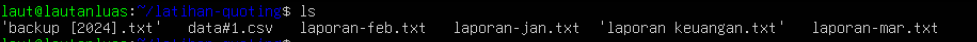

* List backup:


* File arsip tar.gz:
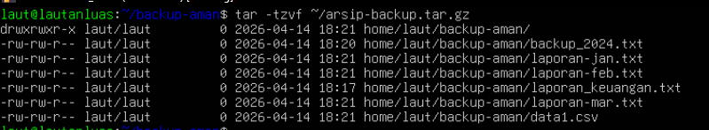

* File riwayat-arsip.txt:
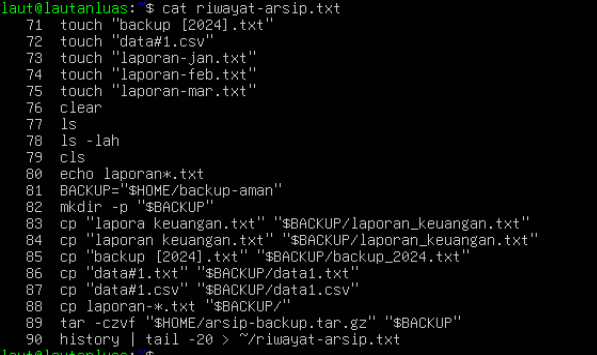

* Pentingnya quoting:
Tanpa quoting, bash memecah nama file berdasarkan spasi sehingga file dengan nama `laporan keuangan.txt` dianggap dua file berbeda. Quoting memastikan bash membaca nama file sebagai satu kesatuan utuh.
